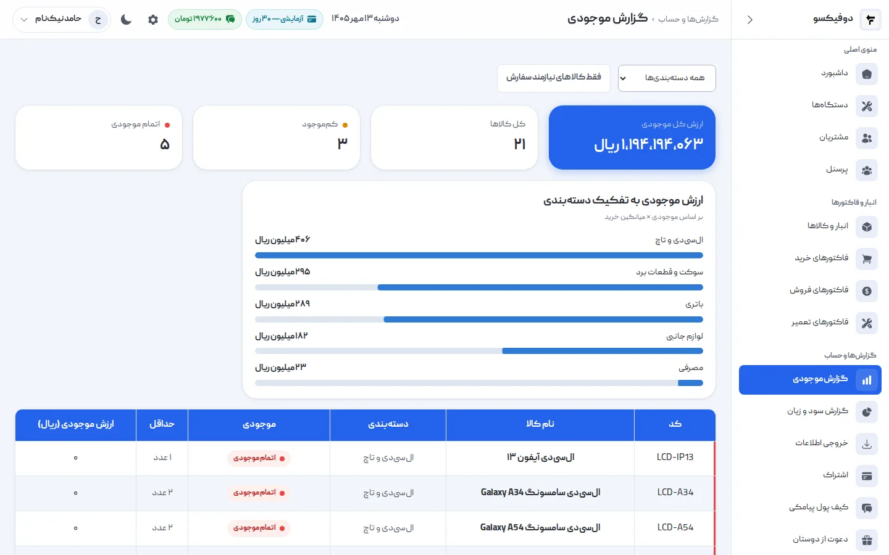
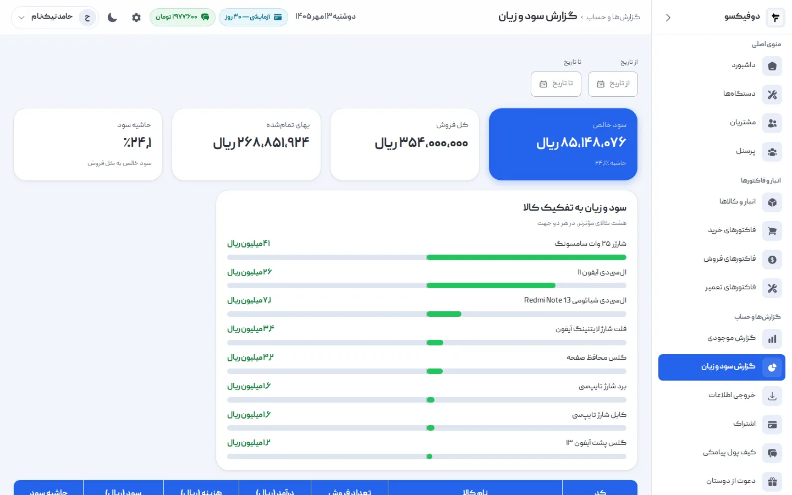
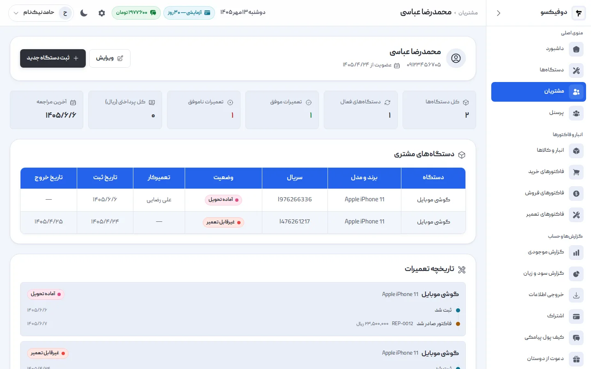
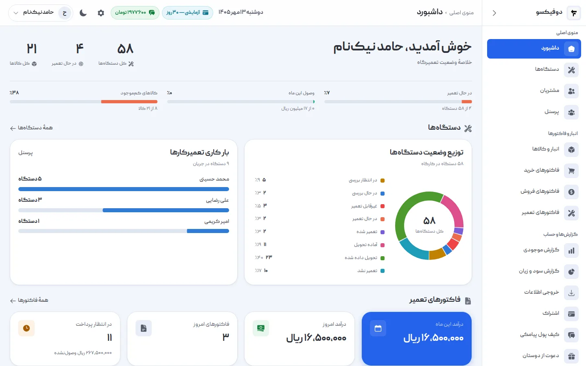

یک تعمیرگاه موبایل با روزی پنج گوشی را می‌شود با حافظه اداره کرد: می‌دانید هر
گوشی مال کیست، چه ایرادی دارد، قطعه‌اش رسیده یا نه و مشتری کِی برمی‌گردد. با روزی
بیست گوشی، دو تعمیرکار و قطعه‌ای که قیمتش هر هفته عوض می‌شود، حافظه دیگر جواب
نمی‌دهد. گوشی‌ها در قفسه می‌مانند، مشتری‌ها زنگ می‌زنند، قطعه‌ای که فکر می‌کردید
دارید تمام شده، و آخر ماه درآمد خوب بوده ولی معلوم نیست پولش کجا رفته.

**مدیریت تعمیرگاه موبایل** یعنی همین کارها را از ذهن یک نفر بیرون بیاورید و در
یک روال ثابت بگذارید: هر گوشی از لحظه‌ی پذیرش تا تحویل یک مسیر مشخص طی کند، و هر
ریالی که وارد یا خارج می‌شود جایی ثبت شود. این راهنما آن روال را در ده بخش
باز می‌کند، و آخرش یک چک‌لیست روزانه، هفتگی و ماهانه دارد که می‌شود چاپش کرد و
کنار میز گذاشت.

<Experience author="davood-jafari">

تعداد دستگاه‌های ورودی زیاد شد و حجم تعمیرات بالا رفت. هر دستگاه عیب و ایراد،
قطعات مصرف‌شده و هزینه‌ی متفاوتی داشت. به خاطر تعداد بالا مجبور بودم برای هر کدام
در دفتر شماره و توضیحات بنویسم؛ دفتری که همیشه دم دستم نبود، گم می‌شد و اطلاعاتم
از دست می‌رفت.

</Experience>

## مدیریت تعمیرگاه موبایل یعنی چه؟

مدیریت تعمیرگاه موبایل یعنی اداره‌ی مسیری که هر گوشی و هر ریال در مغازه طی
می‌کند، طوری که در هر لحظه بشود به این سه سؤال جواب داد:

1. **هر گوشی کجاست و دست کیست؟**
2. **از هر تعمیر چقدر سود ماند؟**
3. **چه کسی به ما بدهکار است و ما به چه کسی؟**

اگر جواب این سه سؤال را بدون پرسیدن از کسی و بدون ورق زدن دفتر می‌دانید، تعمیرگاه
مدیریت می‌شود. اگر نه، تعمیرگاه شما را مدیریت می‌کند.

مسیر هر گوشی در مغازه تقریباً همیشه همین است:

| مرحله | چه اتفاقی می‌افتد | اگر ثبت نشود |
|---|---|---|
| پذیرش | گوشی، مشتری و ایراد ثبت می‌شوند | سر خط و شکستگی بحث پیش می‌آید |
| بررسی | تعمیرکار عیب را پیدا می‌کند | مشتری قیمت را نمی‌داند و منتظر می‌ماند |
| قطعه | قطعه از انبار برداشته یا سفارش داده می‌شود | قطعه‌ای که «داشتید» نیست |
| تعمیر | کار انجام می‌شود | معلوم نیست گوشی دست کیست |
| خبر دادن | مشتری می‌فهمد گوشی آماده است | گوشی هفته‌ها در قفسه می‌ماند |
| تحویل و تسویه | گوشی برمی‌گردد، پول گرفته می‌شود | بدهی مشتری فراموش می‌شود |
| گارانتی | اگر برگشت، معلوم است چه شده بود | سر گارانتی حرف به حرف می‌شود |

بخش‌های بعدی هر کدام یکی از این مرحله‌ها، یا چیزی که پشت همه‌شان است (انبار،
تعمیرکارها، پول، مشتری)، را باز می‌کنند.

## ۱. پذیرش: جایی که نصف بحث‌ها شروع می‌شود

بیشتر بحث‌های یک تعمیرگاه موبایل سر تحویل پیش می‌آیند ولی ریشه‌شان در پذیرش است.
مشتری می‌گوید «گوشی من خط نداشت»، «دوربینش کار می‌کرد»، «این قاب را عوض کردید».
اگر لحظه‌ی پذیرش چیزی نوشته نشده باشد، حرف شما در برابر حرف اوست.

یک پذیرش درست این‌ها را دارد:

- **مشتری:** نام و شماره‌ی موبایل درست. شماره همان راهی است که بعداً با آن خبرش
  می‌کنید.
- **گوشی:** برند، مدل و **IMEI یا سریال**. دو گوشی A54 مشکی را فقط IMEI از هم
  جدا می‌کند.
- **ایرادی که مشتری گفته**، با کلمات خودش: «تاچ پایین صفحه کار نمی‌کند».
- **وضعیت ظاهری** هنگام تحویل گرفتن: خط، شکستگی، قاب، دکمه‌ها، سیم‌کارت و
  مموری داخلش.
- **شماره‌ی پذیرش:** یک شماره‌ی یکتا که مشتری با آن گوشی‌اش را می‌خواهد و شما با
  آن پیدایش می‌کنید.
- **شرایط:** مدت تقریبی، اینکه هزینه‌ی بررسی دارد یا نه، و اینکه گوشی تحویل گرفته
  نشده تا کِی نگه داشته می‌شود.

شماره‌ی پذیرش کوچک‌ترین و مهم‌ترین قسمت این فهرست است. وقتی مشتری زنگ می‌زند و
شماره‌اش را می‌گوید، به‌جای «به چه اسمی ثبت شده؟» و گشتن در قفسه، در چند ثانیه
گوشی را پیدا می‌کنید. شماره باید پشت‌سرهم باشد و هیچ‌وقت تکراری نشود؛ دفترچه‌ی
قبض با شماره‌ی چاپی همین کار را می‌کند، و نرم‌افزار هم باید بکند.

وضعیت ظاهری را در حضور خود مشتری بنویسید و همان‌جا به او نشان بدهید. یک جمله‌ی
«پشت گوشی ترک دارد، مشتری در جریان است» در لحظه‌ی پذیرش، جلوی یک بحث ده‌دقیقه‌ای
هنگام تحویل را می‌گیرد.

اینکه رسید پذیرش دقیقاً چه بخش‌هایی لازم دارد و هر کدام جلوی کدام بحث را می‌گیرد،
در [رسید پذیرش تعمیرات موبایل](/academy/guide/phone-intake-form/) آمده — با یک فرم
دونسخه‌ای رایگان برای چاپ.

پذیرش فقط برای امروز نیست. دستگاهی که یک بار تعمیر شده، دوباره برمی‌گردد — و آن
روز سابقه‌اش همان چیزی است که لازم دارید.

<Experience author="davood-jafari">

بعضی از دستگاه‌های ما دوباره برای تعمیر برمی‌گردند. اگر این موارد را ثبت
می‌کردیم و یادداشت می‌شد، یا می‌توانستیم سوابق آن دستگاه را ببینیم، خیلی خوب
می‌شد.

</Experience>

در دوفیکسو پذیرش یک فرم است: مشتری را جستجو یا همان‌جا تعریف می‌کنید، برند و
مدل و سریال را می‌نویسید، تعمیرکار را انتخاب می‌کنید، و شماره‌ی پذیرش خودکار و
پشت‌سرهم داده می‌شود. اگر پیامک روشن باشد، مشتری همان لحظه پیامک پذیرش با نام
تعمیرگاه و شماره‌ی پذیرشش را می‌گیرد. قدم‌به‌قدمش در [آموزش پذیرش دستگاه در
دوفیکسو](/academy/tutorials/device-intake/) آمده است.

## ۲. پیگیری تعمیر: هر گوشی، یک وضعیت

پرتکرارترین سؤال در هر تعمیرگاه موبایل این است: «این گوشی کجای کار است؟». مشتری
پشت تلفن می‌پرسد، صاحب مغازه از تعمیرکار می‌پرسد، تعمیرکار از خودش.

جواب این سؤال باید **یک کلمه** باشد که هر کسی در مغازه بتواند ببیند. یک مجموعه‌ی
ثابت وضعیت کافی است:

- **در انتظار بررسی** — پذیرش شده، کسی هنوز رویش کار نکرده
- **در حال بررسی** — عیب‌یابی
- **در انتظار قطعه** — عیب معلوم است، قطعه باید برسد
- **در حال تعمیر**
- **تعمیر شده** — کار فنی تمام است
- **آماده تحویل** — مشتری خبر دارد و باید بیاید
- **تحویل داده شده**

و دو پایان ناموفق که باید جدا ثبت شوند: **غیرقابل تعمیر** و **تعمیر نشد** (مثلاً
مشتری قیمت را قبول نکرد). اگر این دو را هم «تحویل داده شده» بزنید، دیگر نمی‌فهمید
چند درصد کارها واقعاً موفق بوده.

ارزش این وضعیت‌ها در فهرست است، نه در تک‌تک گوشی‌ها. وقتی فهرست را با «در انتظار
قطعه» فیلتر کنید، فهرست خرید فردا جلوی شماست. با «آماده تحویل»، فهرست تماس‌های
امروز. با «در انتظار بررسی»، کارهایی که کسی هنوز دست نزده — و اگر گوشی‌ای سه روز
است این‌جاست، چیزی درست کار نمی‌کند.

یک قاعده‌ی ساده: **وضعیت همان لحظه عوض شود، نه آخر روز.** وضعیتی که آخر روز از
حافظه به‌روز شود، همان حافظه است با یک قدم بیشتر.

در [آموزش وضعیت دستگاه در دوفیکسو](/academy/tutorials/device-statuses/) می‌بینید
این وضعیت‌ها چطور از همان فهرست، با یک کلیک، عوض و فیلتر می‌شوند.

## ۳. خبر دادن به مشتری: تماسی که دیگر لازم نیست

هر تماس «گوشیم چی شد؟» چند دقیقه از روز یک نفر را می‌گیرد: گوشی را بردارد، صدا
بزند، از تعمیرکار بپرسد، جواب بدهد. ده تماس در روز، یعنی یک ساعت. و مشتری‌ای که
مجبور است زنگ بزند تا بفهمد، حس می‌کند فراموش شده.

راه‌حلش این است که **قبل از اینکه بپرسد، خبرش کنید** — دست‌کم در سه لحظه:

1. **پذیرش:** «گوشی شما با شماره‌ی ۱۲۳۴ پذیرش شد.» حالا یک شماره دارد که با آن
   پیگیری کند، و می‌داند گوشی‌اش ثبت شده.
2. **آماده‌ی تحویل:** «گوشی شما آماده است.» مهم‌ترینِ این سه؛ هر روزی که گوشی
   تعمیرشده در قفسه بماند، پولش هم در قفسه مانده.
3. **تحویل:** تأییدی که گوشی تحویل شده. اگر کس دیگری گوشی را برده، صاحبش همان
   لحظه می‌فهمد.

بین این سه، اگر قیمت تعمیر از برآورد اول بالاتر رفت یا قطعه دیر کرد، **تلفن**
بزنید، نه پیامک. خبر بد را باید با صدا داد.

در خیلی از تعمیرگاه‌ها مشکل اصلی، مشتری‌ای است که برنمی‌گردد. ولی همیشه این‌طور
نیست:

<Experience author="davood-jafari">

صاحب‌ها همیشه برمی‌گردند، و اتفاقاً همیشه پیگیرند که کارشان زودتر آماده شود.

</Experience>

برای چنین مشتری‌ای، پیامک آماده‌ی تحویل یعنی یک تماس پیگیری کمتر — و مشتری‌ای که
احساس نمی‌کند باید دنبال کارش بدود.

**گوشی‌ای که صاحبش نمی‌آید.** اگر تعمیرگاه شما چند گوشی دارد که تعمیر شده و هفته‌ها
مانده، برای این‌ها یک روال بگذارید: روز اول پیامک آماده‌ی تحویل، یک هفته بعد تماس
تلفنی، و هر تماس را با تاریخش یادداشت کنید. شرط نگهداری را هم از همان پذیرش روی
رسید بنویسید. برای اینکه بعد از چه مدتی و با گوشی رها‌شده چه کاری قانونی است، با
یک مشاور حقوقی صحبت کنید؛ این‌جا جای جوابش نیست.

دوفیکسو همین سه پیامک را می‌فرستد — پذیرش، آماده‌ی تحویل و تحویل — با نام
تعمیرگاه شما و شماره‌ی پذیرش. متن‌شان ثابت است و هزینه‌شان از کیف پول پیامکی خود
تعمیرگاه کم می‌شود.

## ۴. قیمت‌گذاری تعمیر: از روی بها، نه حدس

قیمت یک تعمیر موبایل سه بخش دارد:

- **بهای قطعه** — آنچه واقعاً برای قطعه پرداخته‌اید، نه قیمت امروز بازار.
- **اجرت** — وقت و مهارت تعمیرکار.
- **حاشیه** — برای ریسک: قطعه‌ای که در نصب خراب می‌شود، گارانتی‌ای که برمی‌گردد،
  گوشی‌ای که تعمیر نمی‌شود و وقتش رفته.

بیشترین اشتباه در بخش اول است. وقتی قیمت قطعه‌ها هر هفته با دلار بالا و پایین
می‌رود، «قیمت قطعه» یک عدد نیست. اگر ده ال‌سی‌دی را در سه نوبت با سه قیمت خریده‌اید،
بهای هر کدام **میانگین وزنی** آن سه خرید است: هر خرید به اندازه‌ی تعدادش در
میانگین سهم دارد.

یک مثال ساده:

| خرید | تعداد | قیمت هر عدد |
|---|---|---|
| اول | ۴ | ۳٬۰۰۰٬۰۰۰ ریال |
| دوم | ۶ | ۳٬۵۰۰٬۰۰۰ ریال |

میانگین وزنی: (۴ × ۳٬۰۰۰٬۰۰۰ + ۶ × ۳٬۵۰۰٬۰۰۰) ÷ ۱۰ = **۳٬۳۰۰٬۰۰۰ ریال**. اگر
قیمت تعمیر را از روی خرید اول بدهید، روی هر ال‌سی‌دی ضرر می‌کنید بی‌آنکه بدانید.
اگر از روی گران‌ترین خرید بدهید، از مغازه‌ی بغلی گران‌ترید.

سه قاعده که قیمت‌گذاری را سالم نگه می‌دارد:

1. **قیمت را قبل از تعمیر بدهید و تأیید بگیرید.** بعد از بررسی، به مشتری بگویید
   چقدر می‌شود — یا اگر هنوز دقیق معلوم نیست، دست‌کم یک بازه — و تا تأیید نکرده
   دست نزنید. اگر قبول نکرد، وضعیت «تعمیر نشد».
2. **اجرت را جدا از قطعه بنویسید.** روی فاکتور، قطعه و اجرت دو ردیف جدا باشند.
   مشتری می‌بیند برای چه پول می‌دهد، و شما می‌بینید سودتان از کدام است.
3. **قیمت‌های معمول را یک بار تعریف کنید.** اجرت تعویض باتری یا سوکت شارژ هر بار
   از نو حساب نشود.

<Experience author="davood-jafari">

قیمت از قبل گفته شود، یا دست‌کم یک بازه تعیین شود تا مشتری در جریان باشد.
همچنین مشتری را در روند کار قرار بدهیم.

</Experience>

## ۵. انبار قطعات: موجودی‌ای که به آن اعتماد کنید

قطعه‌های موبایل کوچک و گران‌اند و تنوعشان زیاد است: ال‌سی‌دی هر مدل، باتری هر
مدل، سوکت، فلت، گلس. انباری که فقط در ذهن صاحب مغازه باشد، دو جور ضرر می‌دهد:
**قطعه‌ای که تمام شده و نمی‌دانستید** (مشتری منتظر می‌ماند یا می‌رود) و
**قطعه‌ای که دارید و دوباره خریدید** (پول در قفسه خوابیده).

انبار درست این‌ها را دارد:

- **هر قطعه یک کد** و یک نام روشن: «ال‌سی‌دی Galaxy A54»، نه «ال‌سی‌دی سامسونگ».
- **دسته‌بندی:** ال‌سی‌دی و تاچ، باتری، سوکت و قطعات برد، لوازم جانبی، مصرفی.
- **حداقل موجودی** برای قطعه‌های پرمصرف: عددی که اگر موجودی به آن رسید، وقت
  سفارش است.
- **موجودی که خودش کم و زیاد شود:** با هر خرید زیاد، با هر تعمیر و فروش کم. انباری
  که باید دستی به‌روزش کنید، هفته‌ی دوم دیگر درست نیست.
- **ارزش موجودی:** چقدر پول در قفسه دارید، به تفکیک دسته.

یک بار در ماه فهرست قطعه‌هایی را نگاه کنید که چند ماه است تکان نخورده‌اند. این‌ها
پولی‌اند که در قفسه خوابیده. ال‌سی‌دی مدلی که دیگر کسی نمی‌آورد، هر ماه که بماند
ارزانش هم کسی نمی‌خرد.

<Experience author="davood-jafari">

انبار و قطعات را الان در دوفیکسو مرتب‌شده و قفسه‌بندی‌شده، با کد، نگه می‌داریم
تا موجودی و کمبودها را داشته باشیم. قبلاً باید مدام موجودی چک می‌شد، و مصرف‌هایی
که می‌کردیم ثبت نمی‌شد. همین مشکلاتی درست می‌کرد؛ مثلاً آدم فکر می‌کرد فلان قطعه
را دارد، در حالی که واقعاً نداشت.

</Experience>

## ۶. فاکتور و گارانتی: کاغذی که بعداً به دادتان می‌رسد

فاکتور تعمیر فقط رسید پول نیست. سندی است که سه ماه بعد، وقتی مشتری با همان گوشی
برگشت، معلوم می‌کند چه چیزی عوض شده، کِی و با چه گارانتی‌ای.

فاکتور تعمیر درست این‌ها را دارد:

- **شماره‌ی فاکتور** یکتا و پشت‌سرهم
- **نام، آدرس و تلفن تعمیرگاه** — تا مشتری بداند کجا برگردد
- **گوشی و شماره‌ی پذیرش** — تا فاکتور به همان گوشی وصل باشد
- **قطعه‌ها و اجرت در ردیف‌های جدا**
- **تخفیف و مالیات**، اگر دارد
- **مدت گارانتی و تاریخ پایانش** — نه «گارانتی دارد»
- **پرداخت‌ها:** چقدر، کِی و چطور (نقد، کارت، انتقال)، و چقدر مانده

**گارانتی را مکتوب و با تاریخ بدهید.** «سه ماه گارانتی» روی کاغذی که تاریخ ندارد،
سه ماه بعد بحث است. «گارانتی تا ۱۵ دی ۱۴۰۵» نه. و شرطش را هم بنویسید: گارانتی
شامل چه چیزی هست و چه چیزی نیست (ضربه، آب‌خوردگی، باز شدن توسط دیگری).

**پرداخت چندمرحله‌ای را ثبت کنید.** مشتری‌ای که نصف را امروز و نصف را هفته‌ی بعد
می‌دهد عادی است؛ چیزی که عادی نیست این است که هفته‌ی بعد کسی یادش نباشد. هر
پرداخت با تاریخ و روشش ثبت شود و مانده‌ی فاکتور همیشه معلوم باشد.

در دوفیکسو فاکتور تعمیر به دستگاه وصل است، قطعه را از انبار کم می‌کند، مدت
گارانتی پیش‌فرض را خودش پر می‌کند و تاریخ پایانش را حساب و چاپ می‌کند، و
پرداخت‌ها را در چند نوبت، هر کدام با تاریخ خودش، می‌پذیرد.

<Cta title="فاکتور تعمیر با گارانتی تاریخ‌دار، از همین امروز" />

## ۷. تحویل: آخرین چیزی که مشتری یادش می‌ماند

مشتری از کل تعمیر دو لحظه را می‌بیند: وقتی گوشی را می‌دهد و وقتی پس می‌گیرد. هر
چقدر هم تعمیر خوب بوده باشد، تحویلی که با عجله، بی‌توضیح یا با بحث سر پول تمام
شود، همان چیزی است که مشتری از تعمیرگاه شما تعریف می‌کند.

یک تحویل درست این قدم‌ها را دارد:

1. **گوشی را پیدا کنید، نه بگردید.** با شماره‌ی پذیرش، از قفسه‌ای که گوشی‌های
   آماده‌ی تحویل جدا در آن‌اند.
2. **جلوی مشتری امتحانش کنید.** همان ایرادی که گفته بود: تاچ، شارژ، صدا. سی ثانیه
   امتحان جلوی خودش، جلوی تماس فردا را می‌گیرد که «هنوز درست نشده».
3. **بگویید چه کردید.** «ال‌سی‌دی عوض شد، باتری سالم بود.» اگر قطعه‌ای عوض شده،
   قطعه‌ی قدیمی را اگر خواست نشانش بدهید.
4. **گارانتی را توضیح دهید.** تا کِی، و شامل چه چیزی نمی‌شود. روی فاکتور هم
   نوشته است.
5. **پیش از تحویل تسویه کنید.** یا اگر قرار است بخشی بعداً پرداخت شود، همان‌جا
   ثبتش کنید. گوشی‌ای که با «بعداً حساب می‌کنیم» رفت، پولش اغلب دیگر نمی‌آید.
6. **وضعیت را همان لحظه «تحویل داده شده» بزنید.** تا گوشی از فهرست کارهای باز
   بیرون برود و تاریخ خروجش ثبت شود.

قفسه‌ی گوشی‌های آماده‌ی تحویل را از قفسه‌ی گوشی‌های در حال کار جدا کنید. گوشی
تعمیرشده‌ای که لای گوشی‌های باز مانده، یا اشتباهی به مشتری دیگری داده می‌شود یا
یک تعمیرکار دوباره بازش می‌کند.

وقتی خبر دادن خودکار باشد، تحویل از قبل شروع شده است:

<Experience author="davood-jafari">

تحویل در زیمنس پارت با دوفیکسو انجام می‌شود. نیازی نیست به مشتری زنگ بزنیم:
دوفیکسو پیامک آماده‌ی تحویل را برای مشتری می‌فرستد، و مشتری برای تحویل و تسویه
می‌آید.

</Experience>

## ۸. تعمیرکارها: هر گوشی دست یک نفر

در تعمیرگاهی که بیش از یک تعمیرکار دارد، «این گوشی دست کیه؟» نباید سؤال باشد. هر
گوشی از لحظه‌ی پذیرش به یک نفر سپرده می‌شود، و اگر دست به دست شد، این هم ثبت
می‌شود.

این کار دو فایده دارد. اول، **مسئولیت:** گوشی‌ای که مال همه است، مال هیچ‌کس
نیست. دوم، **عدد:** وقتی معلوم است هر گوشی دست کیست، می‌شود برای هر تعمیرکار این‌ها
را دید:

- چند گوشی **الان** دستش است (بار کاری)
- چند تعمیر **تمام کرده**
- چند درصدش **موفق** بوده
- هر تعمیر **به‌طور میانگین چقدر** طول کشیده

این عددها برای مچ‌گیری نیستند. تعمیرکاری که میانگین زمانش دو برابر بقیه است شاید
کار سخت‌تری می‌گیرد؛ تعمیرکاری که هشت گوشی دستش است و دیگری دوتا، نشان می‌دهد
تقسیم کار درست نیست. بدون عدد، این‌ها حس‌اند؛ با عدد، می‌شود درباره‌شان حرف زد.

اگر فقط یکی را نگاه می‌کنید، از ساده‌ترینش شروع کنید:

<Experience author="davood-jafari">

به نظرم عدد خوبی که داشتیم، تعداد کارهای هر تعمیرکار است.

</Experience>

**دسترسی را محدود کنید.** تعمیرکار لازم دارد گوشی‌ها و مشتری‌ها را ببیند، نه
فاکتورها، سود و زیان و ارزش انبار را. هر کس حساب خودش را داشته باشد، نه یک رمز
مشترک برای همه.

## ۹. پول: درآمد خوب، سود نامعلوم

بسیاری از تعمیرگاه‌ها شلوغ‌اند و درآمد خوبی دارند، ولی آخر ماه صاحبش نمی‌داند چقدر
سود کرده. دلیلش معمولاً یکی از این سه است:

1. **درآمد با سود قاطی می‌شود.** ده میلیون تومان فروش ال‌سی‌دی که بهایش هشت
   میلیون بوده، دو میلیون سود است، نه ده.
2. **بدهی مشتری‌ها دیده نمی‌شود.** فاکتوری که صادر شده ولی پولش نیامده، درآمد
   روی کاغذ است، نه در صندوق.
3. **پول در انبار می‌خوابد.** قطعه‌ای که خریده‌اید و نفروخته‌اید، از صندوق رفته
   ولی هنوز سود نشده.

برای همین سه عدد را جدا از هم نگاه کنید:

- **سود خالص و حاشیه‌ی سود** در یک بازه — فروش منهای بهای تمام‌شده‌ی آنچه
  فروخته‌اید
- **مطالبات** — فاکتورهای پرداخت‌نشده یا نیمه‌پرداخت
- **ارزش موجودی** — پولی که در قفسه است

سود به تفکیک کالا معمولاً غافلگیرکننده است. ممکن است قطعه‌ای که بیشتر از همه
می‌فروشید، کمترین سود را بدهد، و لوازم جانبی‌ای که جدی نمی‌گیرید، حاشیه‌ی خوبی
داشته باشد. تا این عدد را نبینید، نمی‌دانید روی چه چیزی باید وقت بگذارید.

## ۱۰. مشتری: پرونده‌ای که با هر گوشی کامل‌تر می‌شود

مشتری تعمیرگاه موبایل معمولاً برمی‌گردد: با گوشی دیگر، با گوشی همسرش، با همان
گوشی بعد از دو سال. هر بار که برمی‌گردد، این‌ها را باید بدانید:

- قبلاً چه گوشی‌هایی آورده و روی هر کدام چه کاری شده
- گارانتی تعمیر قبلی‌اش هنوز باقی است یا نه
- **بدهی** دارد یا نه
- چیزی هست که کارکنان باید بدانند: «دیر تسویه می‌کند»، «فقط قطعه‌ی اصل می‌خواهد»

این پرونده خودش ساخته می‌شود، به شرطی که هر گوشی را **به مشتری‌اش وصل کنید** و
هر مشتری را **فقط یک بار** ثبت کنید. دو پرونده برای یک آدم — یکی با شماره‌ی قدیمی،
یکی با جدید — یعنی هیچ‌کدام کامل نیست. جستجو را همیشه با شماره شروع کنید.

یادداشت‌های خصوصی مثل «دیر تسویه می‌کند» فقط برای کارکنان است و هرگز نباید روی
فاکتور یا رسیدی که دست مشتری می‌رسد چاپ شود.

## هفت عددی که هر ماه نگاه کنید

لازم نیست ده‌ها گزارش بخوانید. این هفت عدد، اگر هر ماه نگاهشان کنید و با ماه قبل
مقایسه کنید، می‌گویند تعمیرگاه کجا خوب کار می‌کند و کجا نه:

| عدد | چه می‌گوید | اگر بد است |
|---|---|---|
| **گوشی‌های فعال در مغازه** | چقدر کار روی دستتان است | اگر مدام بالا می‌رود، ظرفیت کم است یا گوشی‌ها گیر کرده‌اند |
| **میانگین زمان تعمیر** | مشتری چقدر منتظر می‌ماند | ببینید کدام وضعیت گوشی‌ها را نگه می‌دارد — معمولاً «در انتظار قطعه» |
| **درصد تعمیر موفق** | کیفیت کار و انتخاب کار | تعمیرهای ناموفق را جدا ببینید: مهارت است، قطعه است، یا قیمت؟ |
| **گوشی‌های آماده‌ای که تحویل نشده‌اند** | پولی که در قفسه است | روال تماس با مشتری را جدی‌تر کنید |
| **مطالبات** | پولی که بیرون مانده | پرداخت چندمرحله‌ای را پیگیری کنید؛ پیش از تحویل تسویه بگیرید |
| **حاشیه‌ی سود** | از هر فروش چقدر می‌ماند | قیمت‌گذاری را با بهای واقعی قطعه مقایسه کنید |
| **قطعه‌های کم‌موجود و راکد** | انبار سالم است یا نه | سفارش به‌موقع، و فروش یا کنار گذاشتن قطعه‌های راکد |

اولین ماهی که این عددها را می‌گیرید، فقط یک خط پایه است. ارزش‌شان در مقایسه‌ی ماه
به ماه است.

## از دفتر به نرم‌افزار: کِی وقتش است؟

دفتر و اکسل بد نیستند؛ برای شروع کافی‌اند. ولی چند نشانه می‌گوید وقتش رسیده:

- برای پیدا کردن یک گوشی باید **بیش از یک جا** را بگردید.
- **بیش از یک نفر** پذیرش می‌کند و دفترها با هم نمی‌خوانند.
- مشتری زنگ می‌زند و جواب دادن **بیش از یک دقیقه** طول می‌کشد.
- آخر ماه نمی‌دانید **چقدر سود** کرده‌اید، فقط چقدر فروخته‌اید.
- قطعه‌ای را خریده‌اید که **داشتید**.

نرم‌افزار به‌خودی‌خود تعمیرگاه را مرتب نمی‌کند؛ روالی را که در این راهنما آمده
**نگه می‌دارد**. پس اول روال را مشخص کنید، بعد نرم‌افزاری انتخاب کنید که همان روال
را پیاده کند — نه برعکس. ده معیار انتخاب و یک برنامه‌ی هفت‌روزه برای امتحان در
دوره‌ی رایگان در [بهترین نرم افزار مدیریت تعمیرگاه موبایل: چطور انتخاب
کنیم](/academy/guide/mobile-repair-software/) آمده است.

چند نکته برای گذار:

1. **از پذیرش شروع کنید.** از فردا هر گوشی تازه در نرم‌افزار ثبت شود. گوشی‌هایی
   که الان در مغازه‌اند را هم در یک روز وارد کنید تا دو سیستم موازی نداشته باشید.
2. **انبار را با یک شمارش شروع کنید.** موجودی اولیه‌ای که حدسی وارد شود، از روز
   اول غلط است.
3. **همه از روز اول.** اگر یک تعمیرکار هنوز در دفتر بنویسد، نرم‌افزار نصفه است.
4. **اطلاعات قدیمی را تایپ نکنید.** اگر مشتری‌ها و قطعه‌ها در اکسل‌اند، بیشتر
   نرم‌افزارها راهی برای انتقالشان دارند؛ بپرسید.

<Experience author="davood-jafari">

پیش از نرم‌افزار با دفتر کار می‌کردیم: دستگاه‌ها را دستی ثبت می‌کردیم و
هزینه‌ها و پرداختی‌ها و بقیه را با همان دفتر مدیریت می‌کردیم. الان با دوفیکسو روی
هر دستگاه یک شماره می‌زنیم، و با همان شماره کل کارهایمان، عکس‌هایش و هزینه‌هایش را
داریم.

</Experience>

دوفیکسو یک [نرم‌افزار مدیریت تعمیرگاه](/) تحت وب است که همین روال را از
پذیرش تا سود پیاده می‌کند. نصب لازم ندارد، روی گوشی هم کار می‌کند، و اگر اطلاعات
قبلی دارید، تیم دوفیکسو انتقالش را انجام می‌دهد. [آموزش شروع
سریع](/academy/tutorials/getting-started/) نشان می‌دهد در ده دقیقه چطور راه
می‌افتد.

## چک‌لیست مدیریت تعمیرگاه موبایل

این چک‌لیست را چاپ کنید و کنار میز بگذارید. هر کاری که این‌جاست، کاری است که اگر
انجام نشود، چند روز بعد هزینه‌اش را می‌دهید.

### هر روز

- [ ] هر گوشی تازه با مشتری، IMEI، ایراد، وضعیت ظاهری و شماره‌ی پذیرش ثبت شد
- [ ] وضعیت هر گوشی همان لحظه که عوض شد، به‌روز شد
- [ ] به صاحب هر گوشی «آماده تحویل» خبر داده شد
- [ ] قیمت هر تعمیر پیش از شروع کار به مشتری گفته و تأیید شد
- [ ] هر پرداخت با تاریخ و روشش ثبت شد
- [ ] فهرست «در انتظار قطعه» نگاه شد و سفارش‌ها داده شد

### هر هفته

- [ ] گوشی‌هایی که بیش از یک هفته «آماده تحویل» مانده‌اند: تماس تلفنی، و ثبت تماس
- [ ] گوشی‌هایی که بیش از سه روز «در انتظار بررسی» مانده‌اند: چرا؟
- [ ] قطعه‌های کم‌موجود: سفارش
- [ ] فاکتورهای پرداخت‌نشده: پیگیری
- [ ] بار کاری تعمیرکارها: تقسیم کار متعادل است؟

### هر ماه

- [ ] هفت عدد ماهانه، و مقایسه با ماه قبل
- [ ] سود به تفکیک کالا: کدام قطعه یا خدمت سود نمی‌دهد؟
- [ ] قطعه‌های راکد: فروش، مرجوع یا کنار گذاشتن
- [ ] قیمت‌های معمول تعمیر: با بهای امروز قطعه هنوز می‌خواند؟
- [ ] تعمیرهای ناموفق: الگویی دارند؟
- [ ] پشتیبان اطلاعات: کجاست، و آخرین بار کِی امتحان شد؟

## سؤال‌های رایج

**برای مدیریت تعمیرگاه موبایل حتماً نرم‌افزار لازم است؟**
نه. تعمیرگاه کوچکی که یک نفر اداره‌اش می‌کند، با یک دفتر قبض شماره‌دار و یک دفتر
حساب مرتب هم می‌تواند خوب کار کند. چیزی که لازم است **روال** است. نرم‌افزار وقتی
لازم می‌شود که حجم کار یا تعداد آدم‌ها از حافظه و دفتر بزرگ‌تر شود.

**مهم‌ترین بخش مدیریت تعمیرگاه کدام است؟**
پذیرش. هر چیزی که در پذیرش ثبت نشود — IMEI، ایراد، وضعیت ظاهری، شماره‌ی مشتری —
بعداً یا بحث می‌شود یا پیدا نمی‌شود. اگر فقط یک بخش را امروز مرتب می‌کنید، همین
را.

**چطور تعداد تماس‌های «گوشیم چی شد؟» را کم کنم؟**
قبل از اینکه بپرسد خبرش کنید: پیامک پذیرش با شماره‌ی پذیرش، و پیامک آماده‌ی
تحویل. و وقتی زنگ زد، با همان شماره‌ی پذیرش در چند ثانیه جوابش را بدهید.

**قیمت تعمیر را با نوسان قیمت قطعه چطور تعیین کنم؟**
از روی بهای واقعی قطعه‌ای که در انبار دارید — میانگین وزنی خریدهایتان — نه قیمت
دیروز یا امروز بازار. و قیمت‌های معمول تعمیر را هر ماه با بهای قطعه مقایسه کنید.

**تعمیرکار باید به فاکتورها و سود دسترسی داشته باشد؟**
معمولاً نه. تعمیرکار برای کارش گوشی‌ها و مشتری‌ها را لازم دارد. هر کس حساب جدا
داشته باشد و فقط آنچه را لازم دارد ببیند.

## جمع‌بندی

مدیریت تعمیرگاه موبایل یعنی هر گوشی یک مسیر روشن داشته باشد و هر ریال یک ثبت.
پذیرش کامل، وضعیتی که همان لحظه عوض می‌شود، خبر دادن پیش از پرسیدن، قیمت از روی
بهای واقعی، انبار قابل اعتماد، فاکتور با گارانتی تاریخ‌دار، تحویلی که جلوی مشتری
امتحان می‌شود، کار هر تعمیرکار
جدا، سه عدد پول جدا از هم، و یک پرونده برای هر مشتری. لازم نیست همه را از فردا
داشته باشید: از پذیرش شروع کنید، و هر هفته یک بخش را اضافه کنید.

<NextStep
  title="روال را دارید؛ حالا ده دقیقه وقت بگذارید و راهش بیندازید"
  to="tutorials/getting-started"
  label="آموزش شروع سریع دوفیکسو"
>

اطلاعات تعمیرگاه، گارانتی پیش‌فرض، تعمیرکارها و پیامک به مشتری — در ده دقیقه، و
بعد اولین گوشی را پذیرش کنید.

</NextStep>
