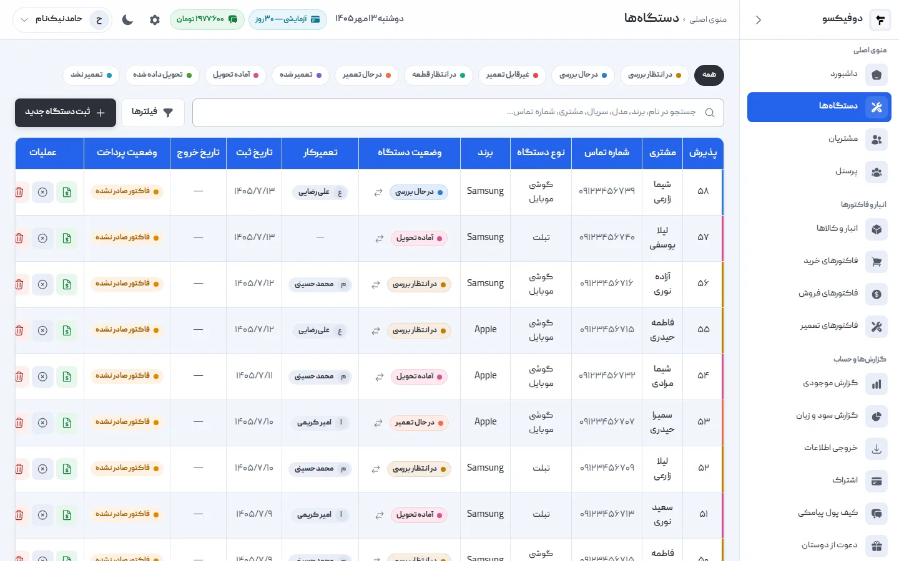
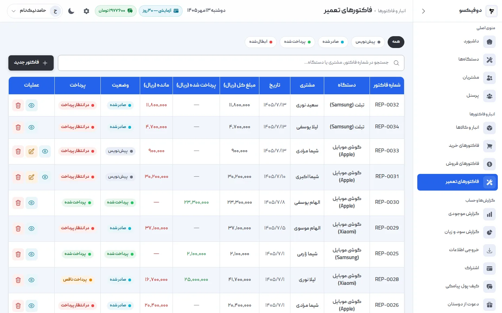
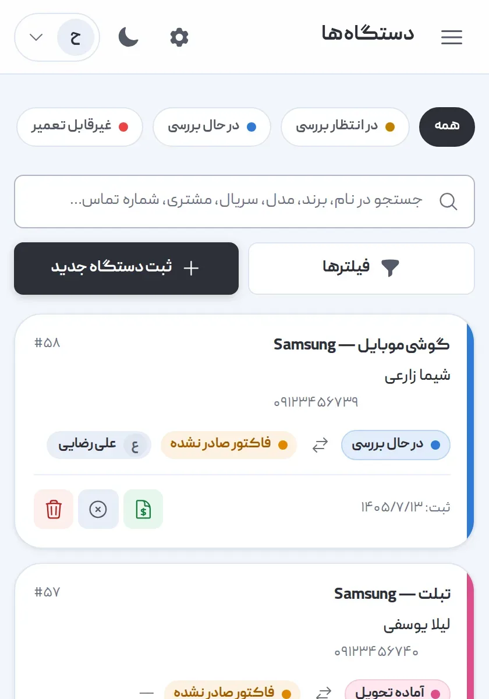

این مقاله را سازنده‌ی یکی از همین نرم‌افزارها نوشته، پس اول همین را بگوییم: ما
درباره‌ی نرم‌افزار رقبا نمره نمی‌دهیم. هر نمره‌ای که ما به رقیب بدهیم، قابل اعتماد
نیست — و هر فهرست «ده نرم‌افزار برتر» که سازنده‌ی یکی از آن‌ها نوشته باشد، همین‌طور.

به‌جایش، چیزی را می‌دهیم که برای انتخاب لازم دارید: **ده معیار** که «بهترین نرم
افزار مدیریت تعمیرگاه موبایل» را برای تعمیرگاه **شما** مشخص می‌کند، یک **برنامه‌ی
هفت‌روزه** برای امتحان هر نرم‌افزاری در دوره‌ی رایگانش، و **سؤال‌هایی** که پیش از
پرداخت باید از فروشنده بپرسید. آخر مقاله هم صادقانه می‌گوییم دوفیکسو برای چه
تعمیرگاهی مناسب است و برای چه تعمیرگاهی نه.

<Experience author="reza-abdollahi">

دوفیکسو را برای تعمیرگاهی ساختم که بخش IT ندارد: یک صاحب مغازه، چند تعمیرکار، و تا
امروز یک دفتر و یک اکسل. برای همین تحت وب است و نصب نمی‌خواهد، تعمیرکار فقط
دستگاه‌ها و مشتری‌ها را می‌بیند و نه حساب و کتاب مغازه را، و بهای قطعه را از
میانگین موزون خریدها حساب می‌کند، چون قیمت قطعه در ایران هر هفته عوض می‌شود. و اگر
روزی اشتراک تمدید نشد، چیزی پاک نمی‌شود — حساب فقط‌خواندنی می‌شود. اطلاعات
مشتری‌های یک تعمیرگاه مال خود آن تعمیرگاه است، نه ما.

</Experience>

## اول بدانید چه مشکلی را حل می‌کنید

نرم‌افزار را برای یک مشکل می‌خرند، نه برای فهرست امکانات. پیش از نگاه کردن به هر
نرم‌افزاری، این جمله را برای خودتان کامل کنید: «اگر فقط یک چیز درست شود، باید
… باشد.»

| اگر مشکل اصلی شما این است | پس این بخش نرم‌افزار از همه مهم‌تر است |
|---|---|
| گوشی‌ها در قفسه گم می‌شوند، معلوم نیست کجای کارند | پذیرش با شماره‌ی یکتا، و وضعیت هر دستگاه |
| مشتری‌ها مدام زنگ می‌زنند | پیامک خودکار به مشتری |
| قطعه‌ای که فکر می‌کردید دارید، تمام شده | انبار که با هر تعمیر خودش کم شود |
| آخر ماه نمی‌دانید چقدر سود کرده‌اید | فاکتور تعمیر با قطعه و اجرت جدا، و گزارش سود |
| معلوم نیست کار هر تعمیرکار چقدر است | سپردن هر دستگاه به یک نفر، و آمار هر تعمیرکار |
| بدهی مشتری‌ها یادتان می‌رود | پرداخت چندمرحله‌ای و مانده‌ی هر فاکتور |

نرم‌افزاری که همه‌ی این‌ها را دارد ولی مشکل اول شما را بد حل می‌کند، برای شما
بهترین نیست.

## ده معیار انتخاب نرم افزار مدیریت تعمیرگاه موبایل

هر معیار یک سؤال است که در دوره‌ی رایگان می‌شود جوابش را خودتان دید، نه از
تبلیغ خواند.

| # | معیار | چطور امتحانش کنید |
|---|---|---|
| ۱ | **پذیرش سریع** | یک گوشی را با مشتری تازه ثبت کنید. بیشتر از یک دقیقه طول کشید؟ |
| ۲ | **شماره‌ی پذیرش** | یکتا و پشت‌سرهم است؟ با آن در یک ثانیه دستگاه پیدا می‌شود؟ |
| ۳ | **وضعیت و پیگیری** | فهرست را با «منتظر قطعه» فیلتر کنید. فهرست خرید فردا جلوی شماست؟ |
| ۴ | **پیامک به مشتری** | چه وقت می‌رود؟ هزینه‌اش با کیست؟ می‌شود برای یک دستگاه خاموشش کرد؟ |
| ۵ | **انبار** | یک قطعه را دو بار با دو قیمت بخرید، در یک تعمیر مصرف کنید. موجودی و بهای تمام‌شده درست شد؟ |
| ۶ | **فاکتور تعمیر** | قطعه و اجرت جدا؟ گارانتی با تاریخ پایان؟ پرداخت در دو نوبت؟ |
| ۷ | **نقش‌ها** | تعمیرکار را تعریف کنید و با حساب او وارد شوید. فاکتور و سود را می‌بیند؟ |
| ۸ | **روی گوشی** | از گوشی خودتان باز کنید و یک دستگاه ثبت کنید. قابل استفاده است؟ |
| ۹ | **داده‌ی شما** | خروجی اکسل دارد؟ پشتیبان‌گیری با کیست؟ اگر روزی رفتید، داده‌تان را می‌برید؟ |
| ۱۰ | **قیمت و پشتیبانی** | قیمت کل سال، نه فقط ماه اول. پشتیبانی چه ساعتی جواب می‌دهد؟ |

### معیارهایی که بیشتر از همه نادیده گرفته می‌شوند

**بهای تمام‌شده‌ی قطعه (معیار ۵).** وقتی قیمت قطعه هر هفته عوض می‌شود، نرم‌افزاری
که بهای قطعه را از آخرین خرید یا اولین خرید حساب کند، سود را اشتباه نشان می‌دهد.
درستش **میانگین موزون** خریدهای موجودی فعلی است. این را با همان امتحان دو خرید با
دو قیمت ببینید.

**هزینه‌ی پیامک (معیار ۴).** پیامک خرج دارد. بپرسید این خرج جزو اشتراک است، جدا
پرداخت می‌شود، یا محدودیت ماهانه دارد — و اگر پیامکی نرسید، پولش برمی‌گردد یا نه.

**داده‌ی شما (معیار ۹).** نرم‌افزاری که داده را بیرون نمی‌دهد، شما را نگه می‌دارد،
نه خدمتش. خروجی اکسل از مشتری‌ها، دستگاه‌ها و فاکتورها حداقل است.

## تحت وب، نصبی یا اپلیکیشن؟

سه نوع نرم‌افزار مدیریت تعمیرگاه هست، و هر کدام بده‌بستان خودش را دارد:

| | تحت وب | نصبی (ویندوز) | اپلیکیشن موبایل |
|---|---|---|---|
| **نصب** | ندارد؛ مرورگر کافی است | روی یک کامپیوتر | از فروشگاه برنامه |
| **روی گوشی** | بله، در مرورگر | معمولاً نه | بله |
| **بدون اینترنت** | نه | بله | بستگی دارد |
| **چند نفر هم‌زمان** | بله، از هر جا | معمولاً فقط شبکه‌ی مغازه | بستگی دارد |
| **پشتیبان‌گیری** | با سرویس‌دهنده | با خود شما | بستگی دارد |
| **اگر کامپیوتر خراب شد** | چیزی از دست نمی‌رود | اگر پشتیبان نداشتید، همه‌چیز | — |

اگر اینترنت مغازه‌تان مدام قطع می‌شود، نرم‌افزار تحت وب برایتان دردسر است — مگر اینکه
اینترنت گوشی پشتیبانش باشد. اگر می‌خواهید از خانه هم ببینید امروز چه گذشت، یا
تعمیرکار از گوشی خودش وضعیت را عوض کند، تحت وب ساده‌ترین راه است.

## برنامه‌ی هفت‌روزه برای امتحان در دوره‌ی رایگان

بیشتر نرم‌افزارها دوره‌ی رایگان دارند، و بیشتر تعمیرگاه‌ها آن را با چند کلیک روی
داده‌ی ساختگی هدر می‌دهند. یک هفته را این‌طور بگذرانید — **روی کار واقعی**:

1. **روز اول — راه‌اندازی:** نام و آدرس و لوگو، یک تعمیرکار، و گوشی‌هایی که امروز
   پذیرش می‌کنید. اگر راه‌اندازی بیش از یک ساعت طول کشید، نشانه‌ی خوبی نیست.
2. **روز دوم — پذیرش واقعی:** همه‌ی گوشی‌های امروز در نرم‌افزار، کنار دفتر.
   شب مقایسه کنید: چیزی در نرم‌افزار جا افتاد که در دفتر نوشتید؟
3. **روز سوم — تعمیرکار:** تعمیرکار با حساب خودش وضعیت‌ها را عوض کند. اگر
   نتوانست یا نخواست، بپرسید چرا. نرم‌افزاری که تعمیرکار استفاده نکند، نصفه است.
4. **روز چهارم — انبار:** ده قطعه‌ی پرمصرف را با موجودی واقعی وارد کنید، یک خرید
   ثبت کنید و یک تعمیر که قطعه مصرف کند.
5. **روز پنجم — فاکتور:** برای یک تعمیر فاکتور بزنید، با قطعه، اجرت، گارانتی و
   پرداخت در دو نوبت. چاپش کنید. می‌شود به مشتری داد؟
6. **روز ششم — مشتری:** پیامک را روشن کنید. یکی از مشتری‌ها را با گوشی‌اش در
   نرم‌افزار پیدا کنید، با شماره و با نام. سابقه‌اش یکجا هست؟
7. **روز هفتم — گزارش:** گزارش سود هفته را بگیرید و با حساب دستی خودتان مقایسه
   کنید. اگر نمی‌خواند، بفهمید چرا.

آخر هفته یک سؤال از خودتان بپرسید: **کدام کار امروز سریع‌تر از دفتر انجام شد؟**
اگر جوابی ندارید، این نرم‌افزار برای شما نیست — حتی اگر بهترین باشد.

## هشت سؤال پیش از خرید

این‌ها را از فروشنده بپرسید. جوابشان معمولاً در صفحه‌ی تبلیغ نیست:

1. **قیمت کل یک سال، با همه‌ی هزینه‌ها، چقدر است؟** پیامک، کاربر اضافه، پشتیبانی.
2. **امکانات پلن‌ها فرق دارد؟** یا فقط مدت و قیمت؟
3. **تعداد کاربر، دستگاه یا مشتری محدود است؟**
4. **وقتی اشتراک تمام شود، داده‌ها چه می‌شوند؟** پاک می‌شوند، قفل می‌شوند، یا
   فقط‌خواندنی؟
5. **داده‌ها کجا نگه داشته می‌شوند و چطور پشتیبان گرفته می‌شود؟**
6. **خروجی اکسل از همه‌چیز دارد؟**
7. **اطلاعات قبلی‌ام را — از اکسل یا نرم‌افزار دیگر — چطور منتقل کنم؟** خودم، یا
   شما؟
8. **پشتیبانی چه ساعتی و از چه راهی جواب می‌دهد؟**

## نشانه‌های خطر

- **آمار بی‌منبع:** «۹۸٪ رضایت»، «بیش از هزار تعمیرگاه» بدون هیچ راهی برای دیدن
  منبعش.
- **امکاناتی که در دوره‌ی رایگان نیست:** اگر مهم‌ترین بخش را نمی‌شود امتحان کرد،
  بعد از خرید هم شاید آن‌طور نباشد که فکر می‌کنید.
- **داده‌ای که بیرون نمی‌آید:** نه خروجی اکسل، نه جواب روشن درباره‌ی رفتن.
- **قول قابلیتی که «به‌زودی» می‌آید:** نرم‌افزار را برای آنچه امروز دارد بخرید.
- **قیمتی که فقط تلفنی گفته می‌شود:** معمولاً یعنی برای هر کس فرق می‌کند.

## دوفیکسو برای چه تعمیرگاهی مناسب است — و برای چه تعمیرگاهی نه

دوفیکسو یک [نرم‌افزار مدیریت تعمیرگاه](/) تحت وب است که برای تعمیرگاه‌های
کوچک و متوسط ایرانی ساخته شده. با ده معیار بالا، این‌طور است:

**مناسب است اگر:**

- یک تعمیرگاه دارید — موبایل، تبلت، لپ‌تاپ، کنسول یا هر دستگاه دیگری؛ نام دستگاه
  آزاد است و به نوع خاصی بسته نیست.
- می‌خواهید از گوشی هم کار کنید و نصب نکنید.
- چند تعمیرکار دارید و می‌خواهید هر کدام حساب خودش را داشته باشد، **بدون اینکه
  فاکتور و سود را ببیند**. تعداد کاربر، دستگاه و مشتری نامحدود است.
- قیمت قطعه‌هایتان مدام عوض می‌شود و بهای تمام‌شده‌ی واقعی (میانگین موزون)
  می‌خواهید.
- می‌خواهید در سه لحظه — پذیرش، آماده‌ی تحویل و تحویل — به مشتری پیامک برود. هزینه‌ی
  پیامک از کیف پول پیامکی خود تعمیرگاه کم می‌شود و جدا از اشتراک است.

**مناسب نیست اگر:**

- **چند شعبه** دارید و می‌خواهید همه را در یک حساب ببینید. دوفیکسو هر تعمیرگاه را
  یک فضای کاری جدا می‌داند.
- اینترنت ندارید یا مدام قطع است. دوفیکسو **حالت آفلاین ندارد**.
- برچسب یا رسید با **QR Code و بارکد** لازم دارید. ندارد.
- می‌خواهید مشتری **خودش آنلاین** وضعیت گوشی‌اش را دنبال کند. ندارد؛ مشتری با
  پیامک خبردار می‌شود.
- دسترسی هر کاربر را **جزءبه‌جزء** تعریف می‌کنید. دوفیکسو سه نقش ثابت دارد.

و جواب هشت سؤال بالا، برای دوفیکسو:

| سؤال | جواب |
|---|---|
| دوره‌ی رایگان | ۳۰ روز، با همه‌ی امکانات |
| فرق پلن‌ها | فقط مدت و قیمت (۱، ۳، ۶ و ۱۲ ماهه)؛ امکانات یکسان. [قیمت‌ها](/pricing/) |
| محدودیت | تعداد کاربر، دستگاه و مشتری نامحدود |
| بعد از تمام شدن اشتراک | حساب فقط‌خواندنی می‌شود؛ چیزی پاک نمی‌شود |
| نگهداری داده | اطلاعات هر تعمیرگاه در پایگاه‌داده از بقیه جداست؛ پشتیبان روزانه، رمزنگاری‌شده، روی فضای ابری جدا |
| خروجی | اکسل از مشتری‌ها، دستگاه‌ها، کالاها و فاکتورها |
| انتقال اطلاعات قبلی | تیم دوفیکسو انجامش می‌دهد |
| پشتیبانی | ۲۴ ساعته |

روی گوشی هم همان نرم‌افزار است، در مرورگر:

برای دیدن اینکه راه‌اندازی‌اش چقدر طول می‌کشد، [آموزش شروع سریع
دوفیکسو](/academy/tutorials/getting-started/) را ببینید، و اگر هنوز روال کار
تعمیرگاهتان را مرتب نکرده‌اید، از [راهنمای جامع مدیریت تعمیرگاه
موبایل](/academy/guide/mobile-repair-shop-management/) شروع کنید: نرم‌افزار روال را
نگه می‌دارد، نمی‌سازد.

## سؤال‌های رایج

**بهترین نرم افزار مدیریت تعمیرگاه موبایل کدام است؟**
آنکه مشکل اصلی تعمیرگاه شما را بهتر از بقیه حل کند و تعمیرکارهایتان واقعاً
استفاده‌اش کنند. با ده معیار این مقاله، دو یا سه نرم‌افزار را در دوره‌ی رایگانشان
روی کار واقعی امتحان کنید.

**نرم افزار رایگان مدیریت تعمیرگاه خوب است؟**
بپرسید پولش از کجا می‌آید و اگر روزی تعطیل شد، داده‌تان چه می‌شود. نرم‌افزاری که
داده‌ی مشتری‌های شما را نگه می‌دارد، باید برای ماندن دلیل داشته باشد.

**نرم افزار تعمیرگاه موبایل برای یک تعمیرگاه یک‌نفره هم لازم است؟**
نه همیشه. اگر روزی چند گوشی می‌گیرید و دفترتان مرتب است، شاید لازم نباشد. وقتی
لازم می‌شود که گوشی‌ها در قفسه گم شوند، مشتری‌ها مدام زنگ بزنند، یا آخر ماه ندانید
چقدر سود کرده‌اید.

**از دفتر به نرم‌افزار رفتن چقدر طول می‌کشد؟**
راه‌اندازی خود نرم‌افزار کوتاه است — در دوفیکسو حدود ده دقیقه. عادت کردن تیم
بیشتر طول می‌کشد. از پذیرش شروع کنید:
از فردا هر گوشی تازه در نرم‌افزار، و گوشی‌های فعلی مغازه را در یک روز وارد کنید.

<NextStep
  title="معیارها را دارید؛ دوفیکسو را با همین ده معیار امتحان کنید"
  to="tutorials/getting-started"
  label="آموزش شروع سریع دوفیکسو"
>

۳۰ روز رایگان با همه‌ی امکانات — کافی است برای برنامه‌ی هفت‌روزه‌ی بالا، روی گوشی‌های
واقعی مغازه‌ی خودتان.

</NextStep>
