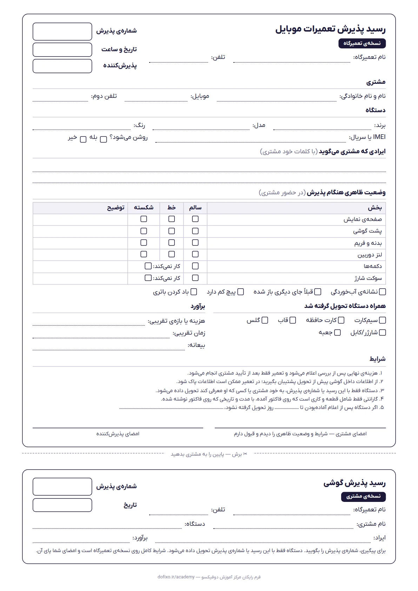
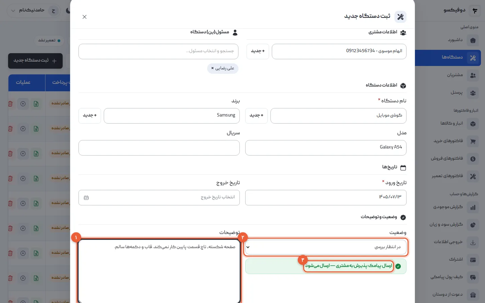

مشتری گوشی را روی پیشخوان می‌گذارد: «صفحه‌ش شکسته، تاچ پایین کار نمی‌کنه.» شما
گوشی را برمی‌دارید، یک نگاه می‌اندازید، می‌گویید «فردا عصر» و گوشی به قفسه
می‌رود. فردا عصر مشتری برمی‌گردد و می‌گوید دوربینش قبلاً سالم بود.

بیشتر بحث‌های تعمیرگاه موبایل همین‌جا شروع می‌شوند: در یک دقیقه‌ای که گوشی تحویل
گرفته شد و چیزی نوشته نشد. **رسید پذیرش تعمیرات موبایل** کاغذی است که آن یک دقیقه
را ثبت می‌کند — برای مشتری، که بداند گوشی‌اش کجاست، و برای شما، که بدانید چه
تحویل گرفته‌اید. این مقاله می‌گوید رسید چه بخش‌هایی لازم دارد و چرا، و آخرش یک
فرم دونسخه‌ای آماده‌ی چاپ دارد. پذیرش اولین بخش از [راهنمای جامع مدیریت تعمیرگاه
موبایل](/academy/guide/mobile-repair-shop-management/) است؛ این‌جا جزئیاتش را
می‌بینیم.

## رسید پذیرش چه بخش‌هایی دارد؟

| بخش | چه چیزی | جلوی چه بحثی را می‌گیرد |
|---|---|---|
| **شماره‌ی پذیرش** | یک شماره‌ی یکتا و پشت‌سرهم | «به چه اسمی ثبت شده؟»؛ گوشی‌ای که با گوشی دیگری قاطی می‌شود |
| **تاریخ و ساعت** | لحظه‌ی تحویل گرفتن | «یک هفته است گوشیم دست شماست» |
| **مشتری** | نام و موبایل، و اگر شد شماره‌ی دوم | مشتری‌ای که نمی‌شود خبرش کرد |
| **دستگاه** | برند، مدل، رنگ، IMEI | دو گوشی یکسان در قفسه؛ گوشی‌ای که «عوض شده» |
| **ایراد** | با کلمات خود مشتری | «من گفتم دوربینش هم مشکل داره» |
| **وضعیت ظاهری** | صفحه، پشت، بدنه، دوربین، دکمه‌ها، سوکت | «این خط قبلاً نبود» |
| **همراه دستگاه** | سیم‌کارت، کارت حافظه، قاب، شارژر | «سیم‌کارتم کجاست؟» |
| **برآورد** | هزینه یا بازه، و زمان تقریبی | «این‌قدر نمی‌شد که» |
| **شرایط و امضا** | قواعدی که مشتری قبول می‌کند | هر بحثی که بالا جا ماند |

هر کدام از این ردیف‌ها، یک بحثی است که یک بار در یک تعمیرگاه پیش آمده. بخش‌های
بعدی سه‌تایی را که بیشتر از همه جا می‌افتند باز می‌کنند.

## شماره‌ی پذیرش: کوچک‌ترین و مهم‌ترین بخش

شماره‌ی پذیرش همان چیزی است که مشتری به آن زنگ می‌زند و شما با آن گوشی را پیدا
می‌کنید. سه قاعده دارد:

1. **یکتا باشد.** دو گوشی نباید یک شماره داشته باشند. دفترچه‌ی قبض با شماره‌ی
   چاپی همین را تضمین می‌کند.
2. **پشت‌سرهم باشد.** شماره‌ای که جا بیفتد، یعنی رسیدی که گم شده یا پاره شده —
   و باید بدانید کدام.
3. **روی گوشی هم باشد.** یک برچسب کاغذی کوچک با همان شماره، پشت گوشی یا روی
   کیسه‌اش. گوشی‌ای که در قفسه شماره ندارد، با رسیدش فاصله دارد.

## وضعیت ظاهری: در حضور مشتری، در یک دقیقه

این بخشی است که بیشتر از همه نوشته نمی‌شود، چون وقت می‌گیرد و مشتری عجله دارد.
ولی یک دقیقه کافی است، اگر ترتیب ثابتی داشته باشد:

1. **صفحه** را خاموش زیر نور نگاه کنید؛ خط‌ها روی صفحه‌ی خاموش بهتر دیده می‌شوند.
2. **پشت گوشی و بدنه:** ترک، فرورفتگی، فریم خم‌شده.
3. **لنز دوربین:** خط یا ترک روی لنز.
4. **دکمه‌ها:** پاور و صدا، یکی‌یکی.
5. **سوکت شارژ:** کابل را بزنید؛ شارژ می‌شود یا نه.
6. **نشانه‌های دیگر:** آب‌خوردگی، پیچی که کم است، باتری باد کرده، نشانه‌ی باز شدن
   قبلی.

هر چه دیدید را **جلوی مشتری** علامت بزنید و به او نشان بدهید. «پشت گوشی ترک
دارد، مشتری در جریان است» در لحظه‌ی پذیرش، یک جمله است؛ هنگام تحویل، یک بحث
ده‌دقیقه‌ای.

اگر گوشی روشن نمی‌شود، همین را بنویسید: «روشن نمی‌شود — صفحه و دوربین و تاچ
بررسی نشد». چیزی را که نمی‌شود امتحان کرد، سالم ننویسید.

**عکس بگیرید.** دو عکس از جلو و پشت گوشی، با گوشی خودتان، کنار رسید. عکس جلوی
بحثی را می‌گیرد که حتی بهترین توضیح نوشته‌شده نمی‌گیرد.

## ایراد را با کلمات مشتری بنویسید

«ال‌سی‌دی» نوشتن وسوسه‌انگیز است، چون شما می‌دانید ایراد کجاست. ولی مشتری چیز
دیگری گفته: «تاچ پایین صفحه کار نمی‌کند». اگر بعد از عوض شدن ال‌سی‌دی تاچ هنوز
مشکل داشت، فقط جمله‌ی خود مشتری معلوم می‌کند شما قرار بود چه چیزی را درست کنید.

دو چیز را جدا بنویسید:

- **آنچه مشتری می‌گوید:** «تاچ پایین صفحه کار نمی‌کند، از وقتی افتاده».
- **آنچه شما در نگاه اول دیدید:** «صفحه از گوشه‌ی پایین ترک دارد».

تشخیص قطعی بعد از بررسی می‌آید، و قیمت با آن.

## برآورد: یک عدد یا یک بازه، پیش از تعمیر

مشتری می‌خواهد بداند چقدر می‌شود. گاهی می‌دانید — تعویض باتری یک مدل مشخص — و
گاهی نه، تا گوشی باز نشود. در هر دو حالت چیزی روی رسید بنویسید:

- **قیمت مشخص**، اگر کار روشن است.
- **یک بازه**، اگر نیست: «بین … تا … تومان، بسته به قطعه».
- و همیشه این جمله: **قیمت نهایی پس از بررسی اعلام می‌شود و تعمیر فقط بعد از
  تأیید مشتری انجام می‌شود.**

اگر بعد از بررسی قیمت از بازه بیرون زد، تلفن بزنید و تأیید بگیرید، و تأیید را با
تاریخ کنار رسید بنویسید.

## رمز گوشی: بپرسید یا نه؟

برای بعضی تعمیرها، امتحان گوشی بعد از کار بدون رمز ممکن نیست. ولی رمزی که روی
رسید نوشته شود، روی کاغذی است که در مغازه دست به دست می‌شود.

- اگر برای کار لازم نیست، **نپرسید**.
- اگر لازم است، **روی رسید ننویسید**. از مشتری بخواهید هنگام تحویل خودش باز کند،
  یا رمز را موقتاً ساده کند و بعد از تحویل عوض کند.
- در شرایط رسید بنویسید که **از اطلاعات داخل گوشی پشتیبان بگیرد**؛ در بعضی
  تعمیرها اطلاعات پاک می‌شود.

## شرایط و امضا: پشت رسید، پیش از تعمیر

شرایط همان قواعدی است که اگر بحثی پیش آمد، به آن برمی‌گردید. باید **پیش از**
تعمیر امضا شود، نه هنگام تحویل. این پنج تا تقریباً در هر تعمیرگاهی لازم است:

1. هزینه‌ی نهایی پس از بررسی اعلام می‌شود و تعمیر فقط با تأیید مشتری انجام
   می‌شود.
2. پشتیبان‌گیری از اطلاعات گوشی با مشتری است.
3. دستگاه فقط با رسید یا شماره‌ی پذیرش، به خود مشتری یا کسی که او معرفی کند
   تحویل داده می‌شود.
4. گارانتی فقط شامل قطعه و کاری است که روی فاکتور آمده، با مدت و تاریخی که روی
   فاکتور نوشته شده.
5. اگر دستگاه پس از اعلام آماده‌بودن تا مدت مشخصی تحویل گرفته نشود، چه می‌شود.

بند پنجم را خودتان پر کنید، و برای اینکه چه چیزی در آن قانونی و قابل استناد است،
با یک مشاور حقوقی مشورت کنید. این مقاله جای جواب حقوقی نیست.

## دو نسخه: یکی برای مشتری، یکی برای شما

رسید باید دو نسخه باشد:

- **نسخه‌ی تعمیرگاه** — کامل: وضعیت ظاهری، شرایط و امضای مشتری. پیش شما می‌ماند.
- **نسخه‌ی مشتری** — کوتاه: نام تعمیرگاه، شماره‌ی پذیرش، دستگاه، ایراد و برآورد.
  مشتری با آن پیگیری می‌کند و گوشی را پس می‌گیرد.

دفترچه‌ی کاربن‌دار همین کار را می‌کند. اگر ندارید، فرم زیر روی یک برگه‌ی A4 هر دو
نسخه را دارد، با خط برش بینشان.

## فرم رایگان رسید پذیرش تعمیرات موبایل

**[دانلود فرم رسید پذیرش (PDF، یک برگه‌ی A4)](/downloads/phone-intake-form.pdf)**

همه‌ی بخش‌های این مقاله در آن هست: شماره‌ی پذیرش، مشتری، دستگاه با IMEI، ایراد با
کلمات مشتری، جدول وضعیت ظاهری، لوازم همراه، برآورد، پنج بند شرایط و جای دو امضا.
نام تعمیرگاه خالی است تا با مهر یا دست خودتان پرش کنید. چاپ سیاه‌وسفید کافی است.

## وقتی رسید کاغذی کم می‌آورد

رسید کاغذی برای یک گوشی کافی است. مشکل وقتی شروع می‌شود که بخواهید بین صد رسید
چیزی پیدا کنید: گوشی‌ای که دو ماه پیش آمده بود و حالا برگشته، یا همه‌ی گوشی‌هایی
که منتظر قطعه‌اند.

در [دوفیکسو](/) پذیرش یک فرم است: مشتری، برند، مدل، سریال، تعمیرکار و ایراد، و
**شماره‌ی پذیرش خودکار و پشت‌سرهم** داده می‌شود. اگر پیامک روشن باشد، مشتری همان
لحظه پیامک پذیرش با نام تعمیرگاه شما و شماره‌ی پذیرشش را می‌گیرد، و چند عکس هم
می‌شود روی خود دستگاه گذاشت. دفعه‌ی بعد که همان گوشی یا همان مشتری برگشت، با
جستجوی شماره یا سریال سابقه‌اش جلوی شماست.

دوفیکسو رسید پذیرش چاپی ندارد، پس این دو جای هم را نمی‌گیرند و کنار هم کار
می‌کنند: فرم کاغذی برای امضای مشتری پای وضعیت ظاهری و شرایط، و شماره‌ی پذیرش
دوفیکسو روی همان فرم. قدم‌به‌قدمش در [آموزش پذیرش دستگاه در
دوفیکسو](/academy/tutorials/device-intake/) آمده است، و اگر تازه شروع می‌کنید، از
[آموزش شروع سریع دوفیکسو](/academy/tutorials/getting-started/).

## سؤال‌های رایج

**رسید پذیرش تعمیرات موبایل حتماً باید امضا شود؟**
نسخه‌ی تعمیرگاه، بله — امضای مشتری پای وضعیت ظاهری و شرایط. بدون امضا، رسید فقط
یادداشت شماست.

**اگر مشتری رسیدش را گم کرد چه کنم؟**
با شماره‌ی پذیرش یا موبایل مشتری، نسخه‌ی تعمیرگاه را پیدا کنید و هویتش را چک
کنید. برای همین است که شماره‌ی موبایل روی نسخه‌ی شما هست.

**برای گوشی‌ای که روشن نمی‌شود، وضعیت ظاهری را چطور بنویسم؟**
آنچه دیده می‌شود را بنویسید — صفحه، پشت، بدنه — و صریح بنویسید که چه چیزی بررسی
نشد: «روشن نمی‌شود؛ تاچ، دوربین و صدا بررسی نشد».

**چه مدت نسخه‌ی تعمیرگاه را نگه دارم؟**
دست‌کم تا پایان گارانتی آخرین تعمیر آن گوشی. اگر گوشی برگشت، رسید پذیرش اولش همان
چیزی است که لازم دارید.

<NextStep
  title="رسید آماده است؛ حالا پذیرش را در دوفیکسو هم ثبت کنید"
  to="tutorials/device-intake"
  label="آموزش پذیرش دستگاه در دوفیکسو"
>

شماره‌ی پذیرش پشت‌سرهم، پیامک پذیرش برای مشتری، و سابقه‌ی هر گوشی که با یک جستجو
پیدا می‌شود — در کمتر از یک دقیقه برای هر گوشی.

</NextStep>
