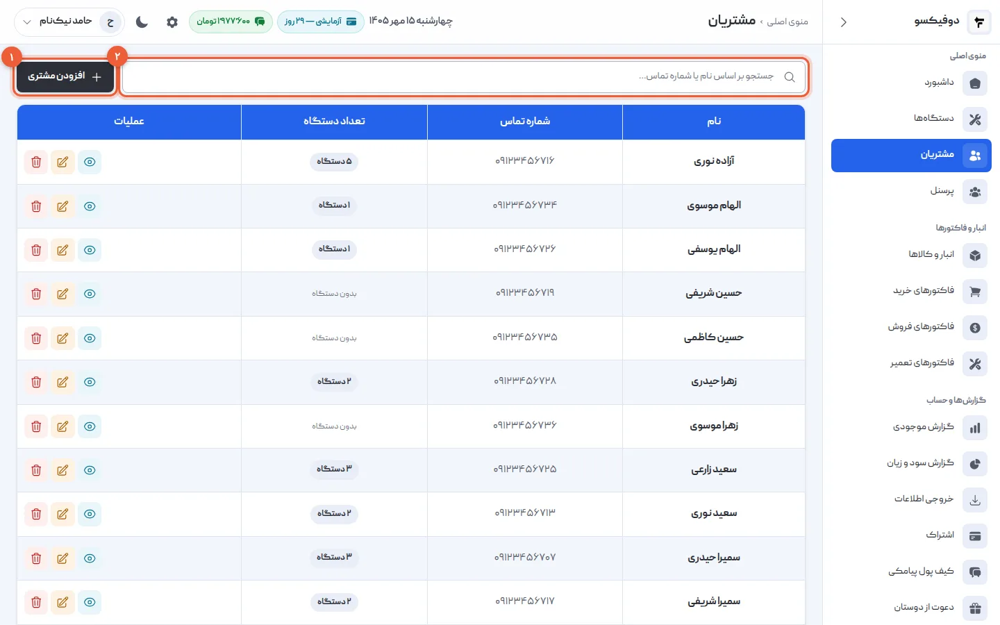
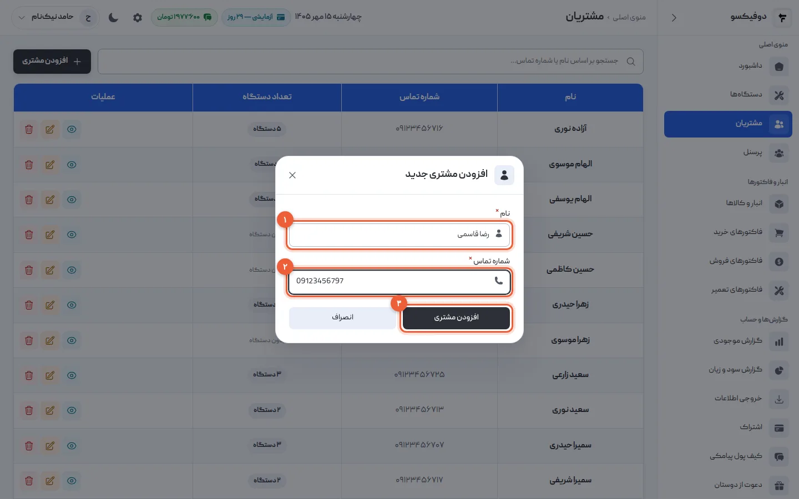
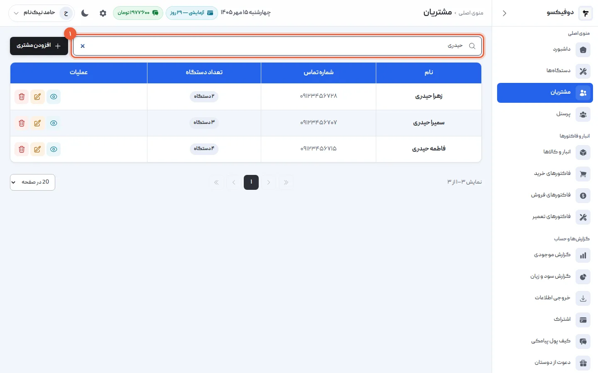
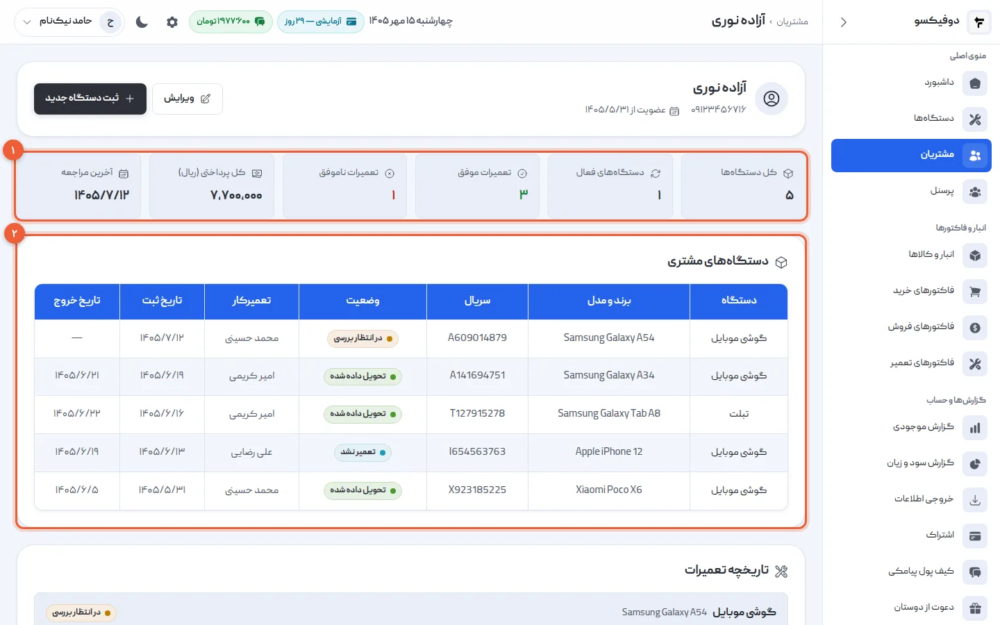
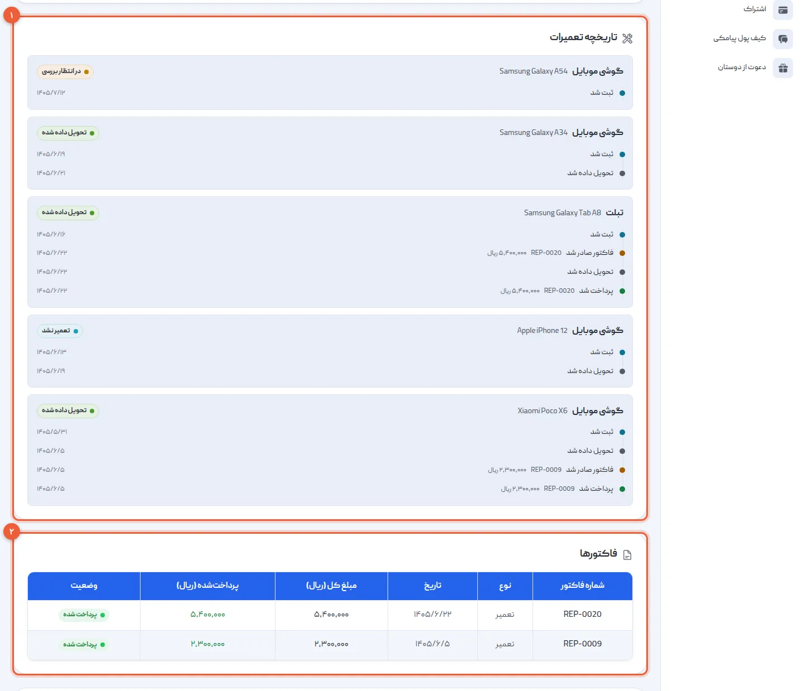
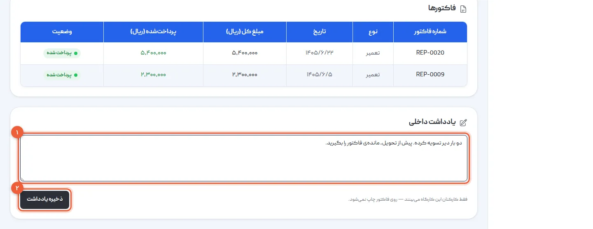
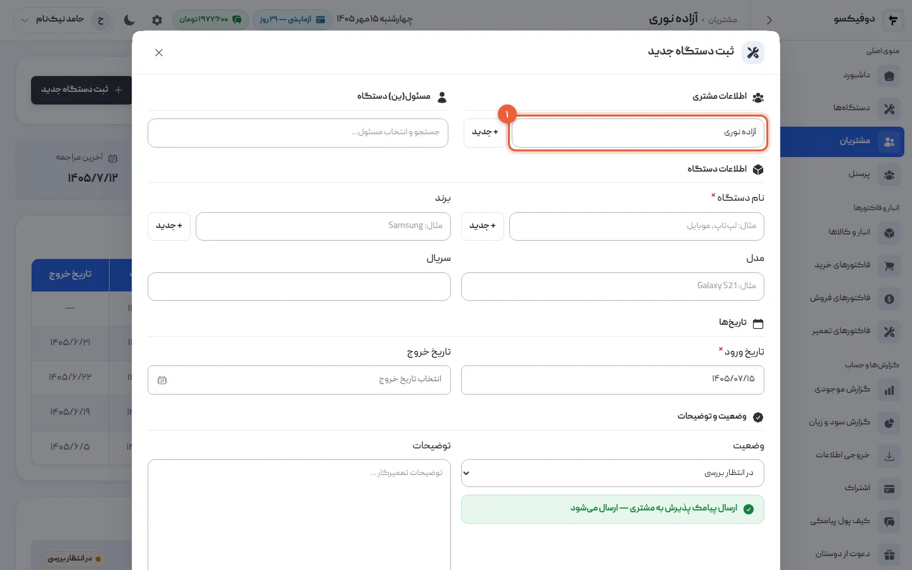
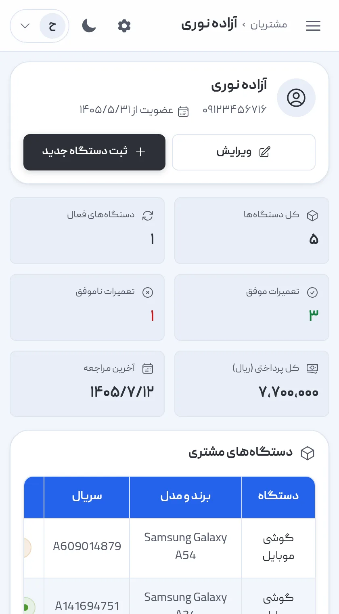

مشتری‌ای که برمی‌گردد، بهترین مشتری تعمیرگاه است — به شرطی که بدانید قبلاً چه
آورده، چه کاری رویش انجام شده و حسابش با شما چطور است. در دوفیکسو هر مشتری یک
پرونده دارد که این‌ها را بی‌آنکه چیزی را جداگانه یادداشت کنید، کنار هم نگه
می‌دارد.

در این آموزش مشتری ثبت می‌کنیم، پیدایش می‌کنیم، پرونده‌اش را می‌خوانیم و برایش
یادداشت خصوصی می‌گذاریم.

## ۱. صفحه‌ی مشتریان

از منوی کناری **«مشتریان»** را باز کنید. همه‌ی مشتری‌ها این‌جا هستند، با شماره‌ی
تماس و تعداد دستگاه‌هایی که آورده‌اند. **«افزودن مشتری»** (۱) و کادر جستجو (۲)
بالای جدول‌اند.

## ۲. مشتری تازه ثبت کنید

«افزودن مشتری» را بزنید، **نام** (۱) و **شماره تماس** (۲) را بنویسید و «افزودن
مشتری» (۳) را بزنید.

همین. لازم هم نیست همیشه از این‌جا شروع کنید: وقتی گوشی تازه‌ای پذیرش می‌کنید،
مشتری‌اش را در همان فرم پذیرش با «+ جدید» می‌سازید و بعد این‌جا پیدایش می‌کنید.

<Callout type="tip">
اگر می‌خواهید مشتری پیامک پذیرش و «آماده‌ی تحویل» بگیرد، **شماره‌ی موبایلش** را
بنویسید، نه تلفن ثابت. پیامک‌ها به همین شماره می‌روند.
</Callout>

## ۳. مشتری را پیدا کنید

در کادر جستجو چند حرف از **نام** یا چند رقم از **شماره‌ی تماس** را بنویسید (۱).
جدول همان لحظه فیلتر می‌شود.

<Callout type="benefit">
مشتری پشت تلفن است و فقط می‌گوید «من گوشی‌ام را هفته‌ی پیش آوردم». با چند رقم از
شماره‌اش، پرونده‌اش جلوی شماست: کدام گوشی بود، دست کیست و به کجا رسیده — بی‌آنکه
دفتر را ورق بزنید یا بگویید «بعداً زنگ می‌زنم».
</Callout>

## ۴. پرونده‌ی مشتری را باز کنید

در ردیف مشتری، **«مشاهده جزئیات»** را بزنید. بالای صفحه خلاصه‌ی او (۱) است:

- **کل دستگاه‌ها** و **دستگاه‌های فعال** — یعنی آن‌هایی که هنوز در مغازه‌اند.
- **تعمیرات موفق** و **تعمیرات ناموفق**
- **کل پرداختی (ریال)** و **آخرین مراجعه**

زیرش **دستگاه‌های مشتری** (۲): هر گوشی‌ای که آورده، با سریال، وضعیت، تعمیرکار و
تاریخ ثبت و خروج.

## ۵. تاریخچه‌ی تعمیرها و فاکتورها

پایین‌تر در همان صفحه:

- **تاریخچه تعمیرات** (۱): برای هر دستگاه، خط زمانی‌اش — کی ثبت شد، کی فاکتورش
  صادر شد، کی پرداخت شد و کی تحویل داده شد.
- **فاکتورها** (۲): فاکتورهای تعمیر و فروش این مشتری، با مبلغ کل، مبلغ
  پرداخت‌شده و وضعیت پرداخت.

فاکتورهای خرید این‌جا نیستند، چون فاکتور خرید به نام تأمین‌کننده است، نه مشتری.

<Callout type="benefit">
وقتی مشتری با گوشی‌ای برگشت که ماه پیش تعمیر کرده بودید، خط زمانی می‌گوید کی
تحویلش گرفته و فاکتورش چه بوده — و از روی فاکتور، گارانتی‌اش هنوز باقی است یا نه.
و اگر حسابی از قبل باز مانده، پیش از تحویل گوشی تازه می‌بینیدش.
</Callout>

## ۶. یادداشت خصوصی بگذارید

پایین پرونده، **«یادداشت داخلی»** (۱) است. هر چه درباره‌ی این مشتری باید یادتان
بماند بنویسید و **«ذخیره یادداشت»** (۲) را بزنید.

<Callout type="benefit">
«دو بار دیر تسویه کرده»، «گوشی را فقط به خودش تحویل بدهید»، «همکار است، تخفیف
همکاری». این یادداشت را **فقط کارکنان** می‌بینند و **روی هیچ فاکتوری چاپ
نمی‌شود** — پس هر تعمیرکاری که این مشتری را جلوی پیشخوان دید، همان چیزی را می‌داند
که شما می‌دانید.
</Callout>

## ۷. گوشی تازه را از همین صفحه پذیرش کنید

مشتری همیشگی با گوشی تازه آمده؟ در پرونده‌اش **«ثبت دستگاه جدید»** را بزنید. فرم
پذیرش باز می‌شود و **مشتری از قبل انتخاب شده** است (۱).

بقیه‌ی پذیرش همان است که در [آموزش پذیرش دستگاه](/academy/tutorials/device-intake/)
آمده. دکمه‌های «ثبت دستگاه جدید» و «ویرایش» بالای پرونده را مدیرها می‌بینند؛ تکنسین
گوشی تازه را از صفحه‌ی «دستگاه‌ها» پذیرش می‌کند.

## روی گوشی هم

پرونده‌ی مشتری روی گوشی هم باز می‌شود — برای وقتی که مشتری زنگ زده و کامپیوتر دم
دستتان نیست.

## ویرایش و حذف

- **ویرایش:** در ردیف مشتری «ویرایش» را بزنید تا نام یا شماره‌اش را عوض کنید.
- **حذف:** فقط مدیرها می‌توانند مشتری را حذف کنند، و این کار برگشت ندارد.
  دستگاه‌ها و فاکتورهای او **پاک نمی‌شوند**، ولی دیگر به هیچ مشتری‌ای وصل نیستند و
  پرونده‌شان از دست می‌رود. اگر مشتری را دو بار ثبت کرده‌اید، پیش از حذف نسخه‌ی
  تکراری مطمئن شوید دستگاهی به آن وصل نیست.

## اگر … شد چه کنم؟

**مشتری در جستجو پیدا نمی‌شود:** شاید با شماره‌ی دیگری ثبت شده. با چند حرف از
نامش جستجو کنید.

**«شماره تماس الزامی است»:** شماره‌ی مشتری را بنویسید؛ بدون شماره، مشتری ثبت
نمی‌شود.

**پیامک به مشتری نمی‌رسد:** شماره‌اش موبایل است؟ پیامک فقط به موبایل می‌رود. اگر
شماره درست است، در **«کیف پول پیامکی»** ببینید پیامک روشن است و اعتبار دارید.

**دکمه‌ی حذف را نمی‌بینم:** حذف مشتری فقط برای مدیرهاست، نه تکنسین.

<NextStep
  title="همه‌چیز آماده است؛ اولین گوشی را پذیرش کنید"
  to="tutorials/device-intake"
  label="آموزش پذیرش دستگاه"
>

پذیرش جایی است که هر کار تعمیر شروع می‌شود: مشتری، مشخصات گوشی، ایراد، تعمیرکار و
پیامک پذیرش — با یک شماره‌ی پذیرش که تا تحویل همراه گوشی می‌ماند.

</NextStep>
