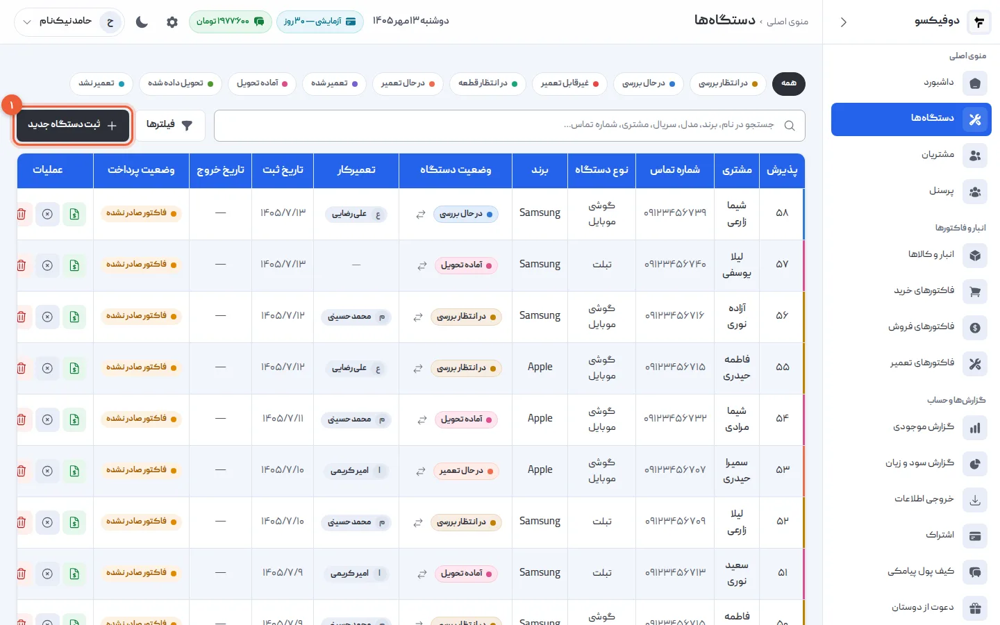
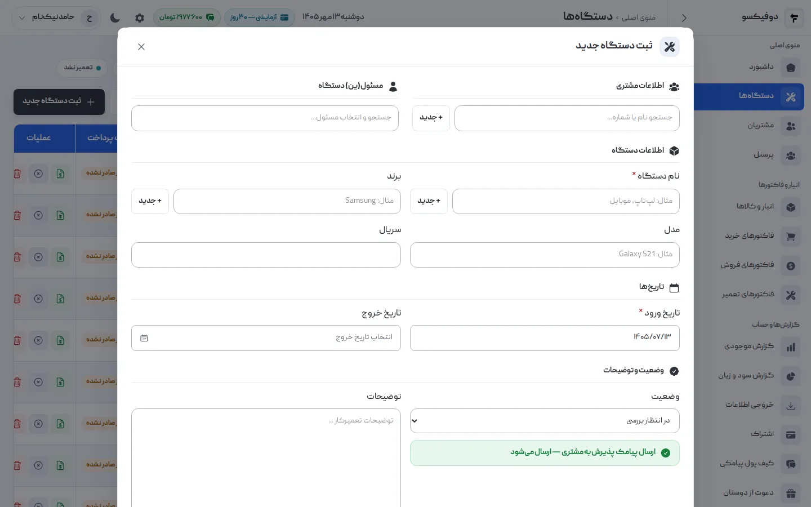
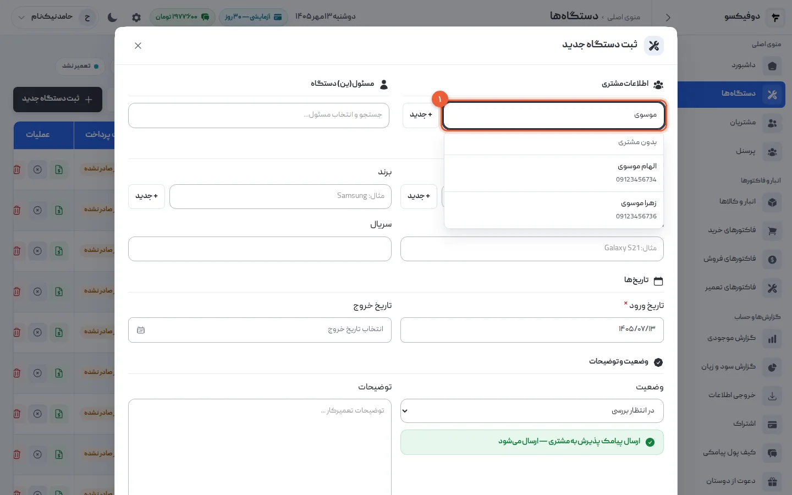
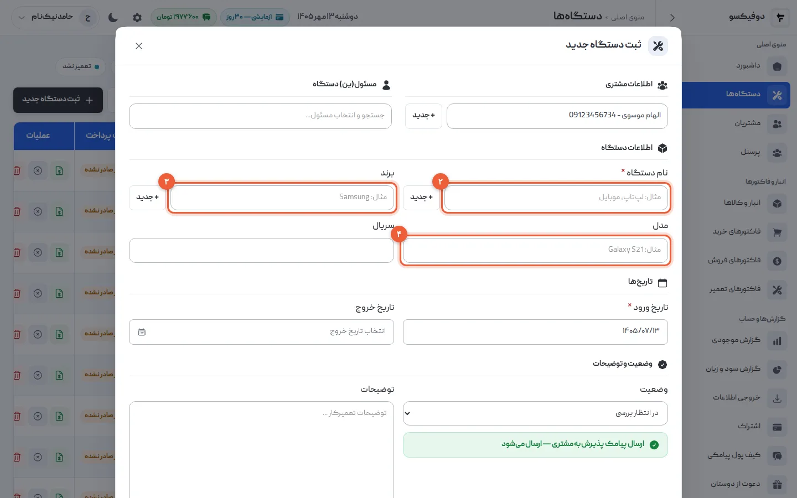
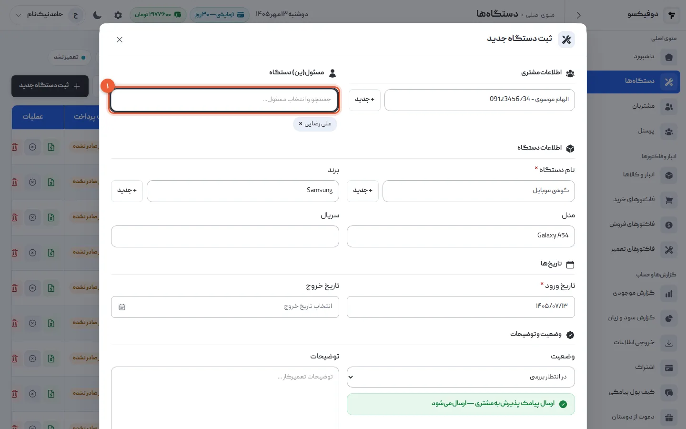
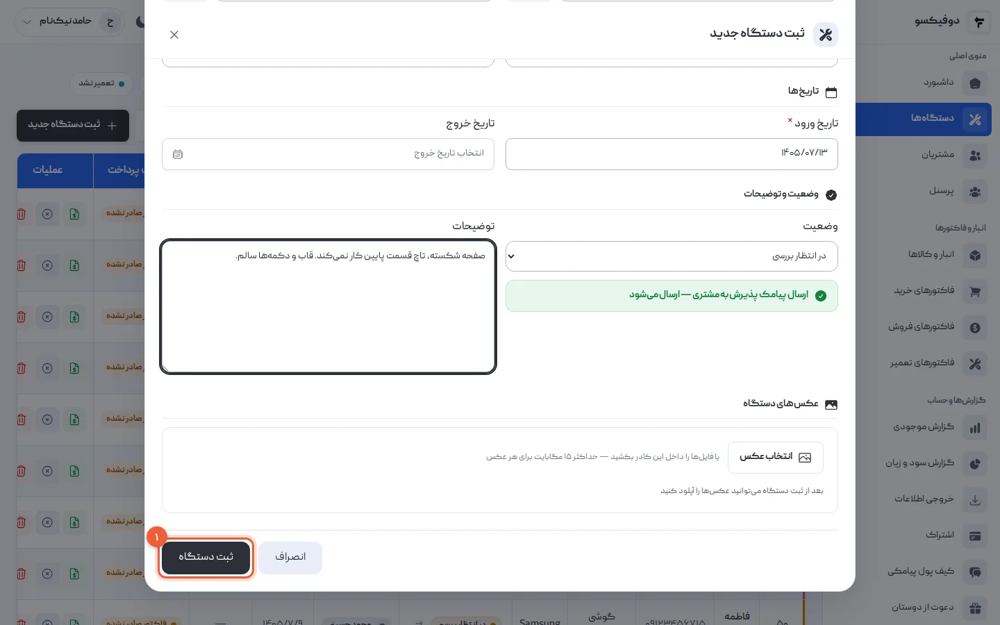
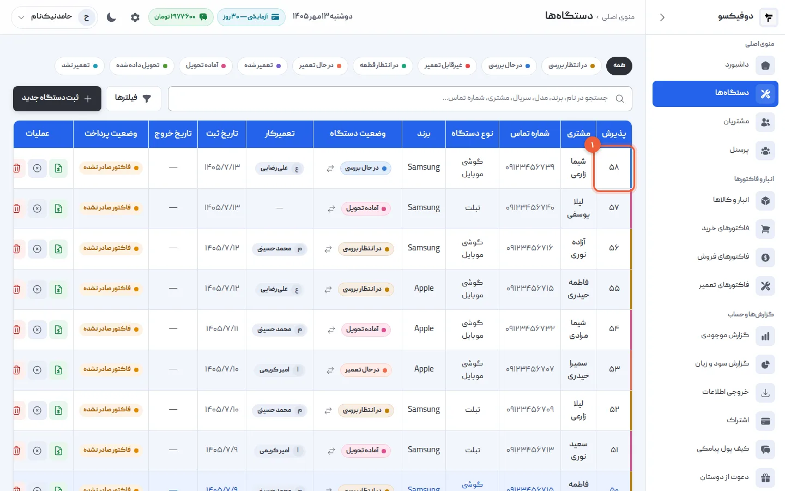

پذیرش، اولین لحظه‌ای است که گوشی مشتری وارد مغازه‌ی شما می‌شود — و اولین جایی
که اگر چیزی ثبت نشود، بعداً سرش بحث پیش می‌آید. در این آموزش یک گوشی را در
دوفیکسو ثبت می‌کنیم: مشتری، مشخصات دستگاه، تعمیرکار، ایرادی که مشتری گفته، و
پیامکی که همان لحظه برایش می‌رود. کل کار کمتر از یک دقیقه طول می‌کشد.

**پیش از شروع:** اگر هنوز وارد دوفیکسو نشده‌اید، از
[ثبت‌نام](https://app.dofixo.ir/register) شروع کنید؛ ۳۰ روز اول رایگان است.
بهتر است تعمیرکارها را هم از قبل در بخش «پرسنل» تعریف کرده باشید. اگر نکرده‌اید،
پذیرش بدون تعمیرکار هم ثبت می‌شود و بعداً اضافه‌اش می‌کنید.

## ۱. فهرست دستگاه‌ها را باز کنید

از منوی کناری «دستگاه‌ها» را باز کنید. همه‌ی دستگاه‌هایی که در مغازه دارید
اینجاست، تازه‌ترین بالا. دکمه‌ی «ثبت دستگاه جدید» بالای جدول است.

## ۲. فرم «ثبت دستگاه جدید» را باز کنید

فرم چهار بخش دارد: اطلاعات مشتری، مسئول دستگاه، اطلاعات دستگاه، و وضعیت و
توضیحات. فقط دو فیلد الزامی است — **نام دستگاه** و **تاریخ ورود** — و تاریخ
ورود خودش امروز را پر کرده است.

## ۳. مشتری را انتخاب کنید

در کادر «جستجو نام یا شماره...» چند حرف از نام یا چند رقم از شماره‌ی مشتری را
بنویسید و او را از فهرست انتخاب کنید.

مشتری تازه است؟ دکمه‌ی «+ جدید» کنار همین کادر را بزنید، نام و شماره‌اش را وارد
کنید و ثبتش کنید؛ همان‌جا انتخاب می‌شود و لازم نیست فرم را ببندید.

<Callout type="benefit">
وقتی دستگاه را به مشتری وصل می‌کنید، این دستگاه وارد **پرونده‌ی همان مشتری** هم
می‌شود. دفعه‌ی بعد که همین مشتری با گوشی دیگری آمد، در صفحه‌اش می‌بینید قبلاً
چه دستگاه‌هایی آورده، چه تعمیری شده، چقدر پرداخته و چه چیزی هنوز مانده — بدون
ورق زدن دفتر.
</Callout>

<Callout type="tip">
شماره‌ی موبایل مشتری را درست وارد کنید. پیامک پذیرش و «آماده‌ی تحویل» به همین
شماره می‌رود.
</Callout>

## ۴. مشخصات گوشی را وارد کنید

- **نام دستگاه** (۲): مثلاً «گوشی موبایل» یا «تبلت».
- **برند** (۳): مثلاً Samsung.
- **مدل** (۴): مثلاً Galaxy A54.

نام دستگاه و برند هر چه قبلاً ثبت کرده‌اید را پیشنهاد می‌دهند؛ با «+ جدید»
کنارشان هم می‌شود به فهرست اضافه کرد. **سریال** را هم اگر دارید بنویسید —
برای گوشی، IMEI بهترین انتخاب است.

<Callout type="benefit">
سریال یا IMEI یعنی وقتی گوشی دوباره به مغازه برگشت — حتی با یک مشتری دیگر — با
جستجوی همین شماره سابقه‌اش را پیدا می‌کنید: قبلاً چه چیزش عوض شده و گارانتی‌اش
هنوز باقی است یا نه.
</Callout>

## ۵. دستگاه را به تعمیرکار بسپارید

در «مسئول(ین) دستگاه» نام تعمیرکار را جستجو و انتخاب کنید. می‌توانید بیش از یک
نفر را انتخاب کنید.

<Callout type="benefit">
وقتی هر دستگاه تعمیرکار مشخص دارد، دیگر لازم نیست بپرسید «این گوشی دست کیه؟».
ستون «تعمیرکار» در فهرست دستگاه‌ها نشان می‌دهد هر گوشی دست کیست، و در صفحه‌ی
هر تعمیرکار معلوم است چند تعمیر
تمام کرده، چند درصدش موفق بوده و هر تعمیر به‌طور میانگین چقدر طول کشیده.
</Callout>

## ۶. ایراد، وضعیت و پیامک پذیرش را مشخص کنید

- **توضیحات** (۱): ایرادی که مشتری گفته و وضعیت ظاهری دستگاه را بنویسید —
  «صفحه شکسته، تاچ پایین کار نمی‌کند، قاب و دکمه‌ها سالم».
- **وضعیت** (۲): برای دستگاه تازه، «در انتظار بررسی» درست است و از قبل انتخاب
  شده.
- **پیامک پذیرش** (۳): اگر پیامک به مشتری را روشن کرده باشید، این نوار سبز است:
  «ارسال پیامک پذیرش به مشتری — ارسال می‌شود». با یک کلیک روی آن، برای همین
  دستگاه خاموش می‌شود.

<Callout type="benefit">
جمله‌ی توضیحات همان چیزی است که اگر مشتری هنگام تحویل گفت «گوشی من خط نداشت»،
به آن برمی‌گردید. و پیامک پذیرش — با نام تعمیرگاه شما و شماره‌ی پذیرش — به
مشتری اطمینان می‌دهد گوشی‌اش ثبت شده و پیگیری دارد؛ اولین قدم برای کم شدن
تماس‌های «گوشیم چی شد؟».
</Callout>

هزینه‌ی پیامک از کیف پول پیامکی خود تعمیرگاه کم می‌شود. اگر پیامک خاموش باشد یا
اعتبار کافی نباشد، نوار خاکستری است، دلیلش زیرش نوشته می‌شود، و دستگاه بدون
پیامک ثبت می‌شود.

## ۷. «ثبت دستگاه» را بزنید

دکمه‌ی «ثبت دستگاه» پایین فرم است.

## ۸. شماره‌ی پذیرش را به مشتری بدهید

دستگاه بالای فهرست ظاهر می‌شود. عدد ستون «پذیرش» شماره‌ی اختصاصی این دستگاه در
تعمیرگاه شماست: برای هر تعمیرگاه از ۱ شروع می‌شود و پشت‌سرهم و بدون جاافتادگی
جلو می‌رود.

<Callout type="benefit">
همین شماره روی فاکتور تعمیر چاپ می‌شود و در پیامک‌های مشتری می‌آید. وقتی
مشتری زنگ می‌زند و شماره‌اش را می‌گوید، با نوشتنش در کادر جستجو در یک ثانیه
دستگاه را پیدا می‌کنید — به‌جای اینکه بپرسید «به چه اسمی ثبت شده؟».
</Callout>

## اگر … شد چه کنم؟

**«نام دستگاه الزامی است»:** فیلد نام دستگاه خالی مانده؛ پرش کنید. این تنها
فیلد الزامی است که خودش پر نمی‌شود.

**مشتری در جستجو پیدا نمی‌شود:** شاید با شماره‌ی دیگری ثبت شده. با چند حرف از
نامش جستجو کنید؛ اگر نبود، با «+ جدید» همان‌جا ثبتش کنید.

**پیامک پذیرش خاکستری است:** یا پیامک به مشتری خاموش است، یا اعتبار کیف پول
پیامکی کافی نیست؛ زیر نوار نوشته کدام. مدیر از همان‌جا به صفحه‌ی کیف پول می‌رود.

**دستگاه را اشتباه ثبت کردم:** از فهرست دستگاه‌ها ویرایشش کنید. شماره‌ی پذیرش
عوض نمی‌شود.

<NextStep
  title="دستگاه ثبت شد؛ حالا نوبت پیگیری تعمیر است"
  to="tutorials/device-statuses"
  label="آموزش مدیریت وضعیت دستگاه"
>

بعد از پذیرش، وضعیت دستگاه را همراه کار جلو می‌برید — در حال بررسی، در انتظار
قطعه، در حال تعمیر، آماده‌ی تحویل — قطعه‌ها و اجرت را در فاکتور تعمیر ثبت
می‌کنید، و وقتی دستگاه را «آماده تحویل» کردید، پیامکش برای مشتری می‌رود تا بیاید
و ببردش.

</NextStep>
