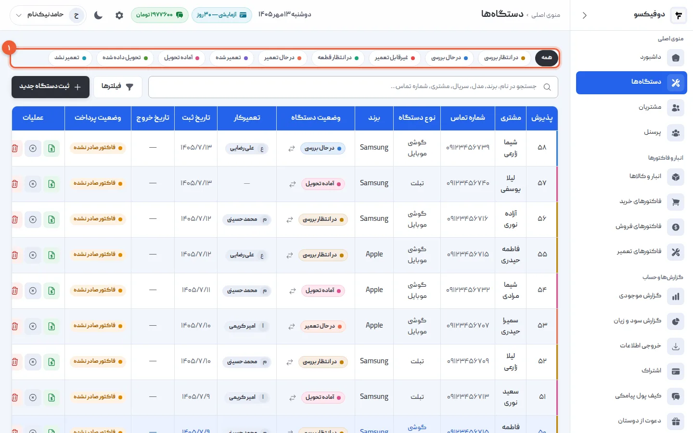
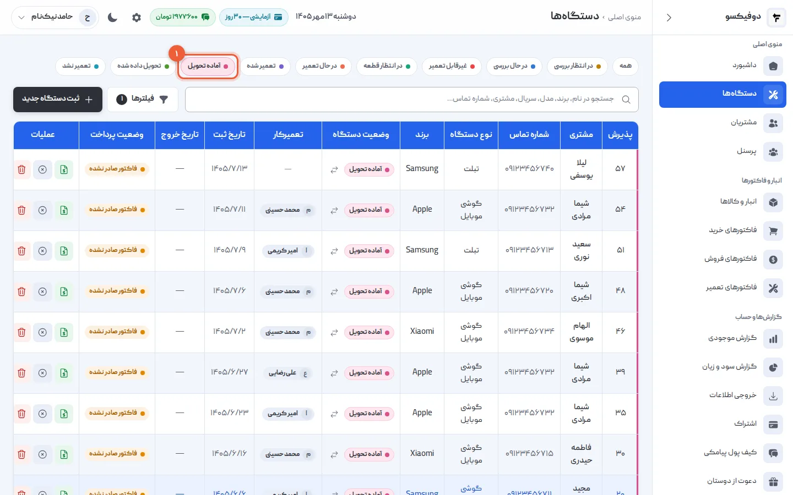
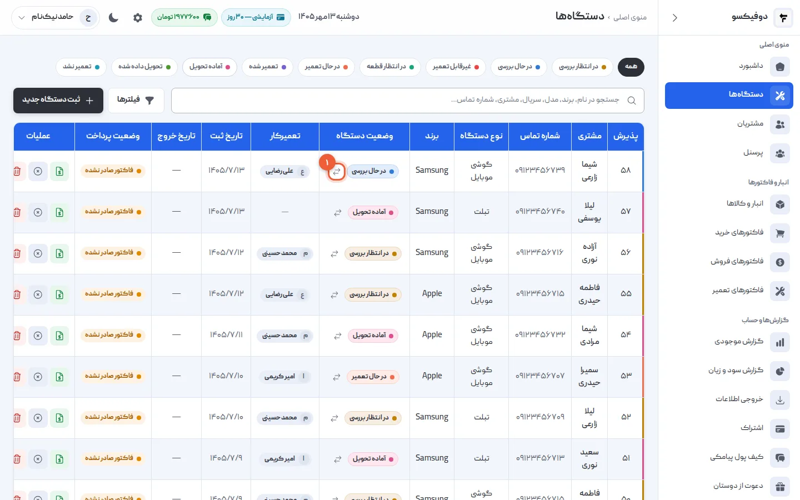
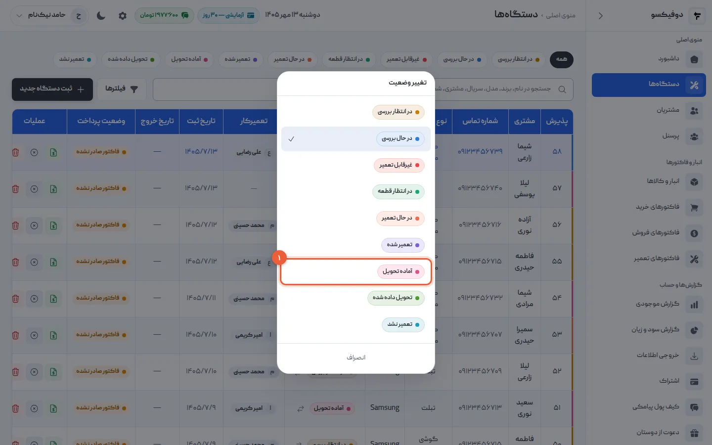
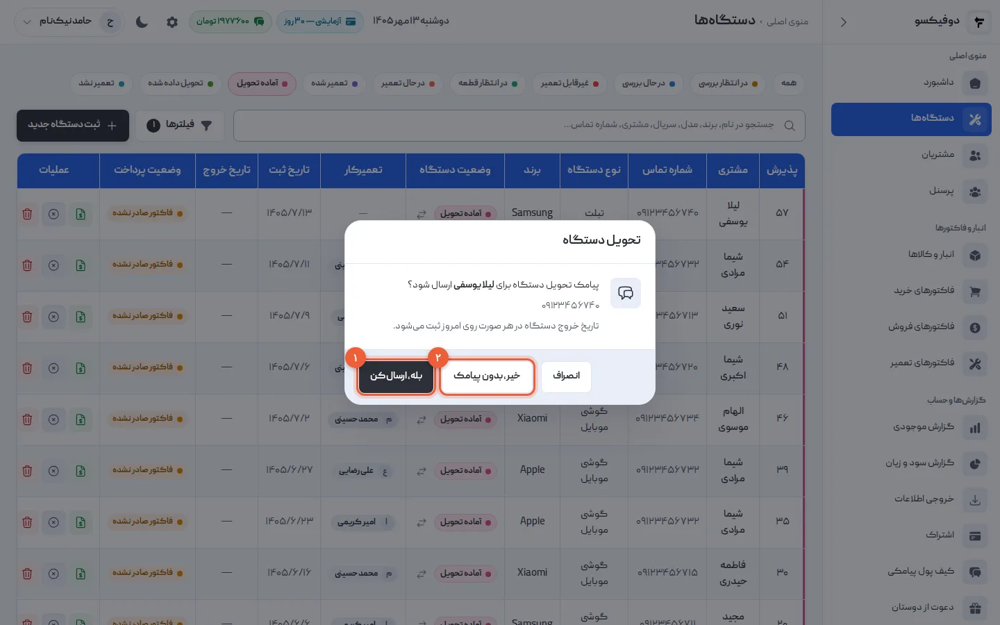
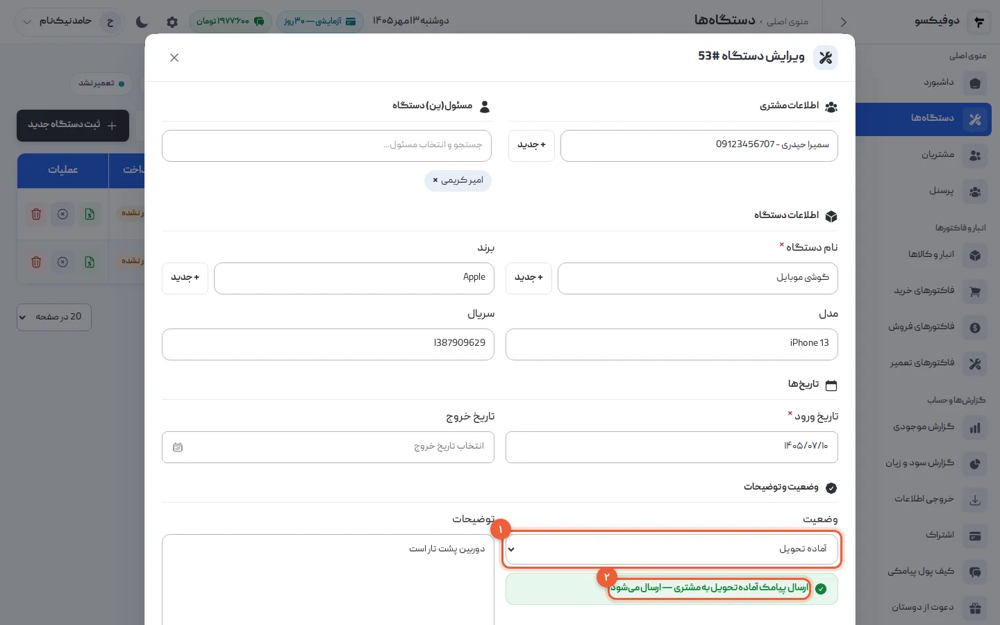

گوشی ثبت شد؛ حالا سؤالی که هر روز چند بار در مغازه پرسیده می‌شود این است: «این
گوشی کجای کار است؟». در دوفیکسو جواب این سؤال **وضعیت دستگاه** است. در این
آموزش می‌بینید هر وضعیت یعنی چه، چطور عوضش کنید، و کدام تغییر وضعیت برای مشتری
پیامک می‌فرستد.

## ۱. نُه وضعیت را بشناسید

دستگاه از بالا به پایین این مسیر را طی می‌کند:

| وضعیت | یعنی |
|---|---|
| در انتظار بررسی | پذیرش شده، هنوز کسی رویش کار نکرده |
| در حال بررسی | تعمیرکار در حال عیب‌یابی است |
| در انتظار قطعه | عیب پیدا شده، قطعه باید برسد |
| در حال تعمیر | تعمیرکار روی دستگاه کار می‌کند |
| تعمیر شده | کار فنی تمام شده، هنوز به مشتری خبر نداده‌اید |
| آماده تحویل | دستگاه منتظر صاحبش است |
| تحویل داده شده | دستگاه به مشتری برگشته |

و دو پایان ناموفق، که از هر جای مسیر می‌شود به آن‌ها رسید: **غیرقابل تعمیر**
(دستگاه نجات‌دادنی نیست) و **تعمیر نشد** (کار انجام نشد — مثلاً مشتری هزینه را
نپذیرفت).

<Callout type="benefit">
این دو وضعیت ناموفق در صفحه‌ی هر تعمیرکار از تعمیرهای موفق جدا شمرده می‌شوند.
اگر گوشی‌ای که تعمیر نشد را «تحویل داده شده» بزنید، نرخ تعمیر موفق آن تعمیرکار
بی‌دلیل بالا می‌رود و دیگر نمی‌دانید کار واقعاً چطور پیش می‌رود.
</Callout>

## ۲. فهرست را با وضعیت فیلتر کنید

بالای فهرست دستگاه‌ها، یک ردیف دکمه هست: «همه» و یک دکمه برای هر وضعیت.

روی «آماده تحویل» بزنید: فقط گوشی‌هایی می‌مانند که تعمیرشان تمام شده و منتظر
صاحبشان‌اند. می‌توانید چند دکمه را با هم روشن کنید — مثلاً «در حال بررسی» و
«در انتظار قطعه» — تا کارهای در جریان را با هم ببینید.

<Callout type="benefit">
فهرست «آماده تحویل» همان قفسه‌ی گوشی‌های تعمیرشده است، بدون اینکه لازم باشد
قفسه را بشمارید. اگر این فهرست بلند شده، یعنی گوشی‌هایی در مغازه مانده‌اند که
پولشان هنوز وصول نشده و جا گرفته‌اند — وقت تماس با صاحبانشان است.
</Callout>

## ۳. دکمه‌ی تغییر وضعیت را پیدا کنید

کنار وضعیت هر دستگاه در ستون «وضعیت دستگاه»، یک دکمه‌ی کوچک با دو فلش هست.

## ۴. وضعیت تازه را انتخاب کنید

پنجره‌ی «تغییر وضعیت» باز می‌شود. وضعیت‌ها به همان ترتیب مسیر تعمیر آمده‌اند،
پس قدم بعدی معمولاً همان ردیف زیر وضعیت فعلی است؛ وضعیت فعلی تیک خورده.

با انتخاب وضعیت، تغییر همان لحظه ذخیره می‌شود و پیام «وضعیت دستگاه بروز شد»
را می‌بینید.

<Callout type="warning">
تغییر وضعیت از این پنجره، برای «آماده تحویل» **پیامک نمی‌فرستد**. اگر می‌خواهید
مشتری خبردار شود، قدم ۶ را ببینید.
</Callout>

## ۵. هنگام تحویل، درباره‌ی پیامک تصمیم بگیرید

وقتی «تحویل داده شده» را انتخاب می‌کنید، دوفیکسو پیش از ذخیره می‌پرسد پیامک
تحویل برای مشتری برود یا نه — با نام و شماره‌ی مشتری، تا اگر شماره اشتباه است
همین‌جا ببینید.

- **«بله، ارسال کن»** (۱): دستگاه تحویل‌شده ثبت می‌شود و پیامک تحویل می‌رود.
- **«خیر، بدون پیامک»** (۲): تحویل ثبت می‌شود، پیامکی نمی‌رود — مثلاً وقتی مشتری
  جلوی شما ایستاده.
- **«انصراف»**: هیچ چیز عوض نمی‌شود.

تاریخ خروج دستگاه در هر حال روی امروز ثبت می‌شود؛ لازم نیست جدا پرش کنید. اگر
پیامک به مشتری خاموش باشد یا اعتبار کیف پول پیامکی کافی نباشد، این پرسش نمی‌آید
و تحویل مستقیم ثبت می‌شود.

## ۶. «آماده تحویل» را با پیامک ثبت کنید

برای اینکه مشتری بفهمد گوشی‌اش آماده است، وضعیت را از **فرم ویرایش دستگاه**
عوض کنید: روی ردیف دستگاه در فهرست بزنید تا «ویرایش دستگاه» باز شود، در
«وضعیت» (۱) «آماده تحویل» را انتخاب کنید و «ذخیره تغییرات» را بزنید.

با انتخاب «آماده تحویل»، نوار سبز (۲) ظاهر می‌شود: «ارسال پیامک آماده تحویل به
مشتری — ارسال می‌شود». یک کلیک رویش، پیامک را برای همین بار خاموش می‌کند.

<Callout type="benefit">
پیامک آماده‌ی تحویل — با نام تعمیرگاه شما و شماره‌ی پذیرش — همان تماسی است که
دیگر لازم نیست بگیرید، و مشتری هم لازم نیست زنگ بزند و بپرسد «گوشیم چی شد؟».
گوشی زودتر از قفسه بیرون می‌رود و پولش زودتر وصول می‌شود.
</Callout>

## چه وقت پیامک می‌رود و چه وقت نه؟

| تغییر | پیامک |
|---|---|
| ثبت دستگاه تازه | پیامک پذیرش (در فرم ثبت، قابل خاموش کردن) |
| رفتن به «آماده تحویل» از فرم ویرایش | پیامک آماده‌ی تحویل (قابل خاموش کردن) |
| رفتن به «آماده تحویل» از پنجره‌ی تغییر وضعیت | — |
| رفتن به «تحویل داده شده» | در پنجره‌ی تغییر وضعیت می‌پرسد؛ در فرم ویرایش، نوار پیامک تحویل |
| رفتن به «تعمیر شده» | — (دستگاهی که هنوز بررسی و قیمت نشده، آماده‌ی بردن نیست) |
| ویرایشی که وضعیت را عوض نکند | — |

همه‌ی پیامک‌ها از کیف پول پیامکی خود تعمیرگاه پرداخت می‌شوند و فقط وقتی که پیامک
به مشتری روشن باشد.

## اگر … شد چه کنم؟

**وضعیت را اشتباه زدم:** دوباره از دکمه‌ی تغییر وضعیت درستش کنید. اگر وضعیت
اشتباه «تحویل داده شده» بود و پیامک رفته، پیامک برنمی‌گردد؛ شاید لازم باشد به
مشتری زنگ بزنید.

**پرسش پیامک تحویل نیامد:** یا پیامک به مشتری خاموش است، یا اعتبار کیف پول
پیامکی تمام شده. مدیر از صفحه‌ی «کیف پول پیامکی» هر دو را می‌بیند.

**دستگاهی مدت‌هاست «آماده تحویل» مانده:** هنوز در آمار دستگاه‌های فعال است. با
مشتری تماس بگیرید؛ اگر دیگر برنمی‌گردد، وضعیتی بزنید که با واقعیت بخواند.

<NextStep
  title="تعمیر تمام شد؛ حالا نوبت فاکتور است"
  to="tutorials/repair-invoice"
  label="آموزش فاکتور تعمیر"
>

برای گوشی‌ای که تعمیر شده، فاکتور تعمیر صادر می‌کنید: قطعه‌ای که مصرف شد از انبار
کم می‌شود، اجرت جدا ثبت می‌شود، پرداخت مشتری — حتی در چند نوبت — ثبت می‌شود و
مدت گارانتی روی فاکتور چاپ می‌شود.

</NextStep>
