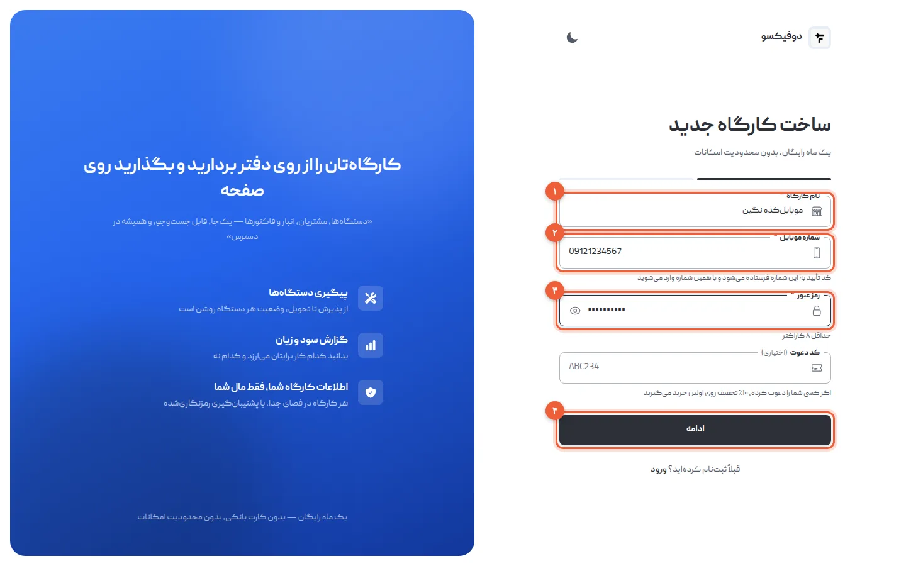
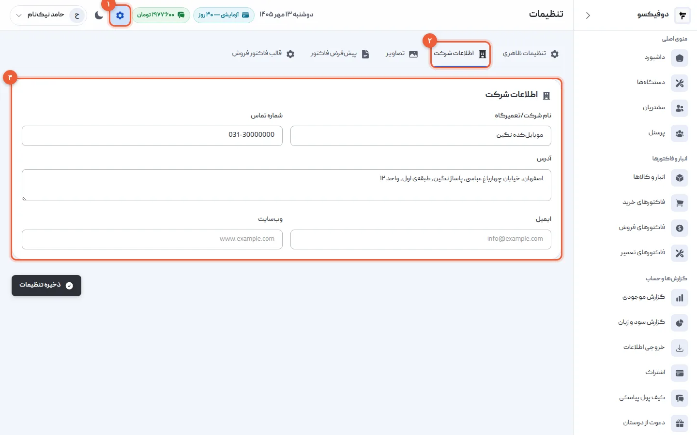
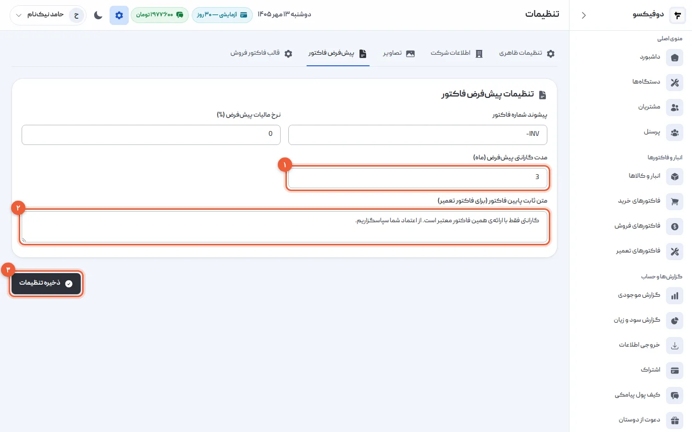
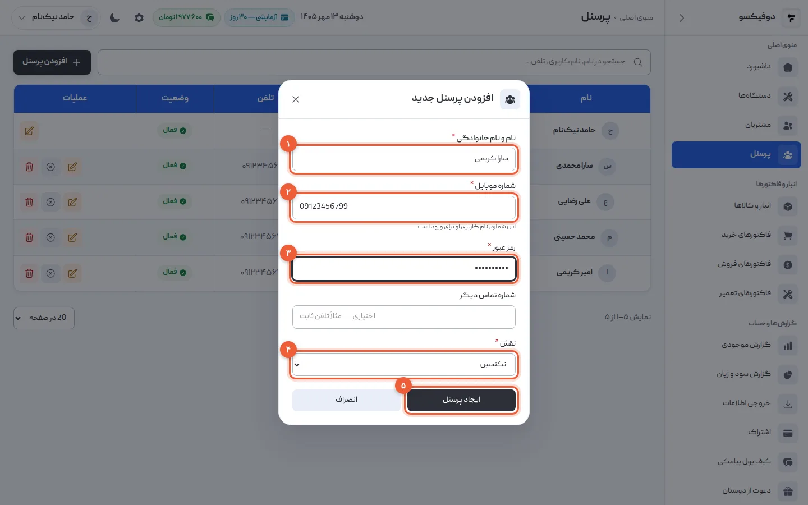
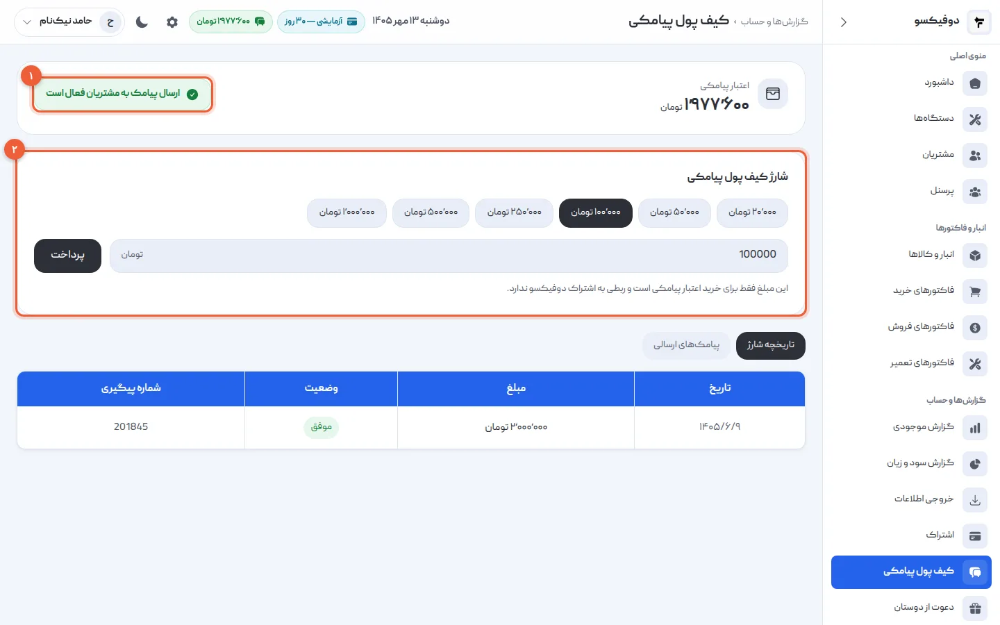
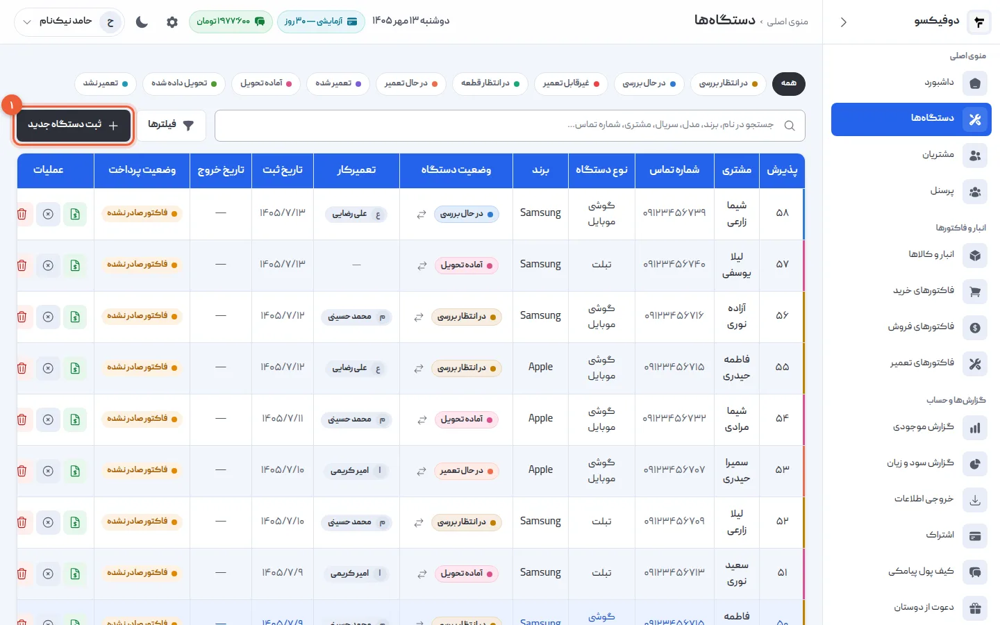
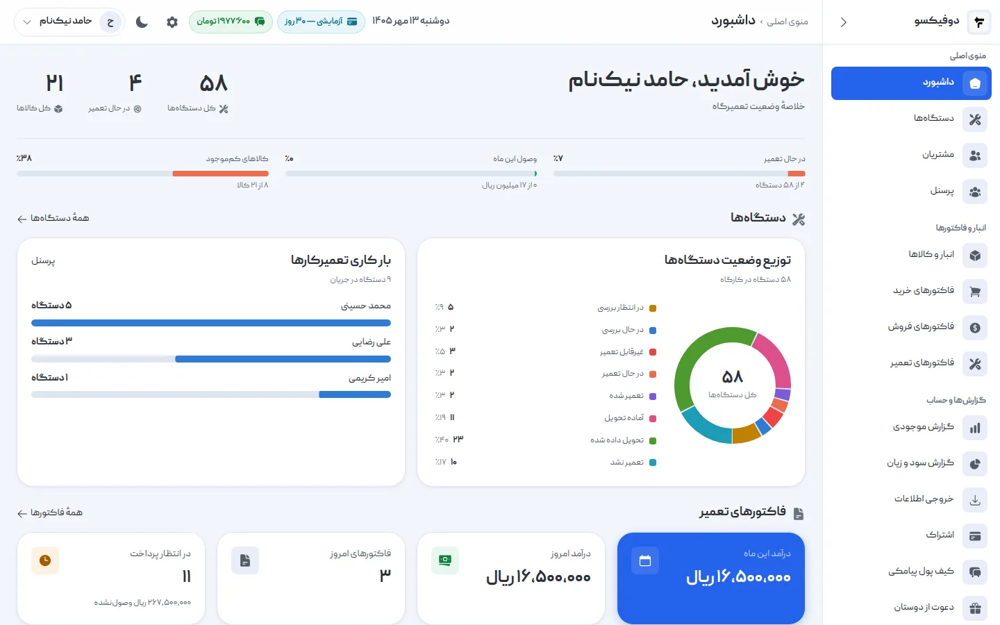
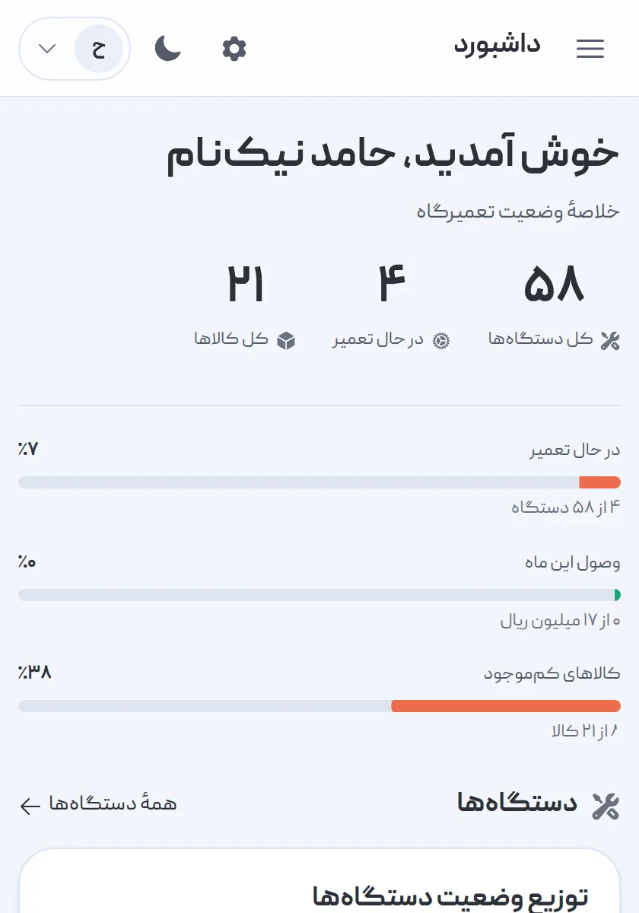

این آموزش اولین روز شما در دوفیکسو است: حساب می‌سازید، اطلاعات تعمیرگاه را
وارد می‌کنید، تعمیرکارها را اضافه می‌کنید و پیامک به مشتری را روشن می‌کنید. آخرش
آماده‌اید اولین گوشی را پذیرش کنید. کل کار حدود ده دقیقه است، و لازم نیست همه را
یک‌جا انجام دهید — فقط قدم ۱ پیش از هر چیز لازم است.

دوفیکسو تحت وب است: نصب لازم ندارد و روی کامپیوتر و گوشی، در هر مرورگری، کار
می‌کند. به اینترنت نیاز دارد؛ حالت آفلاین ندارد.

## ۱. حساب تعمیرگاه را بسازید

به [صفحه‌ی ثبت‌نام](https://app.dofixo.ir/register) بروید و سه چیز وارد کنید:

- **نام کارگاه** (۱): همان نامی که مشتری‌ها می‌شناسند.
- **شماره موبایل** (۲): کد تأیید به همین شماره می‌آید، و از این به بعد با همین
  شماره وارد می‌شوید.
- **رمز عبور** (۳): دست‌کم ۸ کاراکتر.

«ادامه» (۴) را بزنید، کد پیامکی را وارد کنید و «ساخت کارگاه» را بزنید. همان لحظه
وارد دوفیکسو می‌شوید.

اگر تعمیرگاه دیگری شما را دعوت کرده، کد دعوتش را در «کد دعوت» بنویسید؛ روی اولین
خرید اشتراک ۱۰٪ تخفیف می‌گیرید.

<Callout type="benefit">
۳۰ روز اول رایگان است، **با همه‌ی امکانات** — نه نسخه‌ی محدود. اطلاعات پرداخت هم
لازم نیست. اگر بعد از ۳۰ روز اشتراک نخرید، چیزی پاک نمی‌شود: حساب فقط‌خواندنی
می‌شود و هر وقت برگشتید، همه‌چیز سر جایش است.
</Callout>

## ۲. اطلاعات تعمیرگاه را وارد کنید

روی آیکون چرخ‌دنده‌ی **«تنظیمات»** (۱) بالای صفحه بزنید و به تب **«اطلاعات
شرکت»** (۲) بروید. «نام شرکت/تعمیرگاه»، «شماره تماس» و «آدرس» (۳) را پر کنید و
«ذخیره تنظیمات» را بزنید.

بعد در تب **«تصاویر»** لوگو را بارگذاری کنید. اگر روی فاکتور مهر و امضا
می‌زنید، تصویر آن‌ها را هم همین‌جا بگذارید.

<Callout type="benefit">
این اطلاعات یک بار وارد می‌شوند و روی **هر فاکتوری** که چاپ می‌کنید می‌آیند. مشتری
فاکتوری با نام، آدرس، شماره و لوگوی شما می‌گیرد — نه کاغذی دست‌نویس که فردا
گمش می‌کند — و اگر گوشی برگشت، می‌داند کجا را پیدا کند.
</Callout>

## ۳. گارانتی و متن پایین فاکتور را تنظیم کنید

در تب **«پیش‌فرض فاکتور»**:

- **مدت گارانتی پیش‌فرض (ماه)** (۱): مدتی که معمولاً روی تعمیر گارانتی می‌دهید.
  پیش‌فرضش ۳ ماه است.
- **متن ثابت پایین فاکتور** (۲): جمله‌ای که زیر هر فاکتور تعمیر چاپ می‌شود؛ مثلاً
  شرط گارانتی.

«ذخیره تنظیمات» (۳) را بزنید.

<Callout type="benefit">
وقتی فاکتور تعمیر صادر می‌کنید، مدت گارانتی از قبل پر شده و **تاریخ پایانش خودکار
حساب می‌شود** و روی فاکتور چاپ می‌شود. ماه بعد که مشتری با همان گوشی برگشت، لازم
نیست دنبال قبض بگردید یا روی حرفش حساب کنید: فاکتور می‌گوید گارانتی هنوز باقی است
یا نه.
</Callout>

تب‌های «اطلاعات شرکت»، «تصاویر» و «پیش‌فرض فاکتور» را فقط سازنده‌ی حساب می‌بیند.

## ۴. تعمیرکارها را اضافه کنید

از منوی کناری **«پرسنل»** را باز کنید و **«افزودن پرسنل»** را بزنید.

- **نام و نام خانوادگی** (۱)
- **شماره موبایل** (۲): نام کاربری تعمیرکار برای ورود است.
- **رمز عبور** (۳): دست‌کم ۸ کاراکتر. به خود تعمیرکار بدهید.
- **نقش** (۴): برای تعمیرکار، «تکنسین».

«ایجاد پرسنل» (۵) را بزنید. تعمیرکار حالا با شماره‌ی خودش و همین رمز، از گوشی یا
کامپیوتر خودش وارد می‌شود.

سه نقش هست: **سوپر ادمین** (سازنده‌ی حساب، همه‌چیز)، **ادمین** (همه‌ی بخش‌های
کاری) و **تکنسین** (فقط دستگاه‌ها و مشتری‌ها). تعداد کاربر محدود نیست.

<Callout type="benefit">
تکنسین فقط **دستگاه‌ها** و **مشتری‌ها** را می‌بیند — نه فاکتورها، نه انبار، نه سود
و زیان. پس می‌توانید به هر تعمیرکار حساب خودش را بدهید، بی‌آنکه حساب و کتاب مغازه
جلوی چشم همه باشد. و چون هر دستگاه به تعمیرکار مشخصی سپرده می‌شود، در صفحه‌ی هر
نفر می‌بینید چند تعمیر تمام کرده و چقدر طول کشیده.
</Callout>

## ۵. پیامک به مشتری را روشن کنید

از منوی کناری **«کیف پول پیامکی»** را باز کنید.

- دکمه‌ی **«ارسال پیامک به مشتریان»** (۱) پیامک را روشن یا خاموش می‌کند. سبز یعنی
  روشن.
- در **«شارژ کیف پول پیامکی»** (۲) مبلغی انتخاب یا وارد کنید و «پرداخت» را بزنید.
  کمترین شارژ ۲۰ هزار تومان است.

دوفیکسو در سه لحظه برای مشتری پیامک می‌فرستد: وقتی گوشی **پذیرش** می‌شود، وقتی
**آماده‌ی تحویل** است، و وقتی **تحویل** داده می‌شود. متن پیامک‌ها ثابت است و نام
تعمیرگاه شما و شماره‌ی پذیرش دستگاه در آن می‌آید.

<Callout type="benefit">
پیامک «آماده‌ی تحویل» همان تماسی است که دیگر لازم نیست بگیرید، و پیامک پذیرش
همان قبضی است که مشتری گم نمی‌کند. هزینه‌ی پیامک از **کیف پول خود تعمیرگاه** کم
می‌شود و جدا از اشتراک است؛ اگر ارسال پیامکی شکست بخورد، پولش به کیف پول برمی‌گردد.
</Callout>

این قدم اختیاری است: بدون پیامک هم همه‌چیز کار می‌کند.

## ۶. اولین گوشی را پذیرش کنید

از منوی کناری **«دستگاه‌ها»** را باز کنید و **«ثبت دستگاه جدید»** (۱) را بزنید.
مشتری را انتخاب یا همان‌جا تعریف کنید، مشخصات گوشی و ایرادش را بنویسید و تعمیرکار
را انتخاب کنید.

قدم‌به‌قدمش با تصویر در [آموزش پذیرش دستگاه در
دوفیکسو](/academy/tutorials/device-intake/) آمده است، و اینکه بعد از پذیرش کار
گوشی را چطور تا تحویل پیگیری کنید در [آموزش وضعیت
دستگاه](/academy/tutorials/device-statuses/).

## ۷. هر روز را از داشبورد شروع کنید

**«داشبورد»** خلاصه‌ی امروز تعمیرگاه است: چند دستگاه در مغازه دارید و هر کدام در
چه وضعیتی است، کار هر تعمیرکار چقدر است، درآمد امروز و این ماه، فاکتورهایی که
هنوز پولشان نیامده، و قطعه‌هایی که موجودی‌شان به حداقل رسیده.

داشبورد را مدیرها می‌بینند؛ در منوی تکنسین نیست.

همین صفحه روی گوشی هم باز می‌شود. لازم نیست پشت کامپیوتر مغازه باشید تا ببینید
امروز چه خبر است.

## اطلاعات قبلی دارید؟

اگر مشتری‌ها، دستگاه‌ها یا انبارتان را در اکسل یا نرم‌افزار دیگری دارید، لازم
نیست دوباره تایپشان کنید: **تیم دوفیکسو انتقالش را برایتان انجام می‌دهد**. با
[پشتیبانی](/contact/) تماس بگیرید. پشتیبانی ۲۴ ساعته است.

## اگر … شد چه کنم؟

**کد تأیید نیامد:** شماره را دوباره نگاه کنید؛ «ویرایش شماره» فرم پرشده را
برمی‌گرداند تا درستش کنید. بعد از تمام شدن شمارش معکوس، «ارسال دوباره‌ی کد» را بزنید.

**«این شماره موبایل قبلاً ثبت شده است»:** با این شماره حساب دارید، یا تعمیرگاه
دیگری شما را به‌عنوان پرسنل تعریف کرده. از صفحه‌ی ورود وارد شوید، و اگر رمز یادتان
نیست، از «رمز عبور را فراموش کرده‌اید؟».

**تب «اطلاعات شرکت» را نمی‌بینم:** این تب‌ها فقط برای سازنده‌ی حساب (سوپر ادمین)
است. با حساب او وارد شوید.

**تعمیرکار نمی‌تواند وارد شود:** نام کاربری‌اش همان شماره موبایلی است که در
«افزودن پرسنل» نوشتید. اگر رمزش را فراموش کرده، از «پرسنل» ویرایشش کنید و رمز تازه
بگذارید.

<NextStep
  title="همه‌چیز آماده است؛ اولین گوشی را پذیرش کنید"
  to="tutorials/device-intake"
  label="آموزش پذیرش دستگاه"
>

پذیرش، جایی است که هر کار تعمیر شروع می‌شود: مشتری، مشخصات گوشی، ایراد، تعمیرکار
و پیامک پذیرش — در کمتر از یک دقیقه، با یک شماره‌ی پذیرش که تا تحویل همراه گوشی
می‌ماند.

</NextStep>
