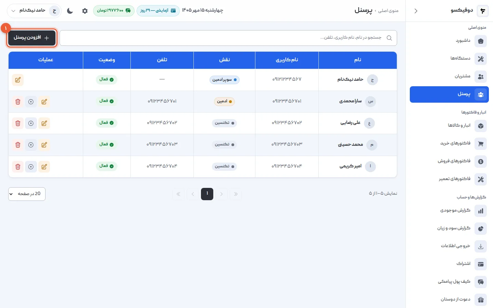
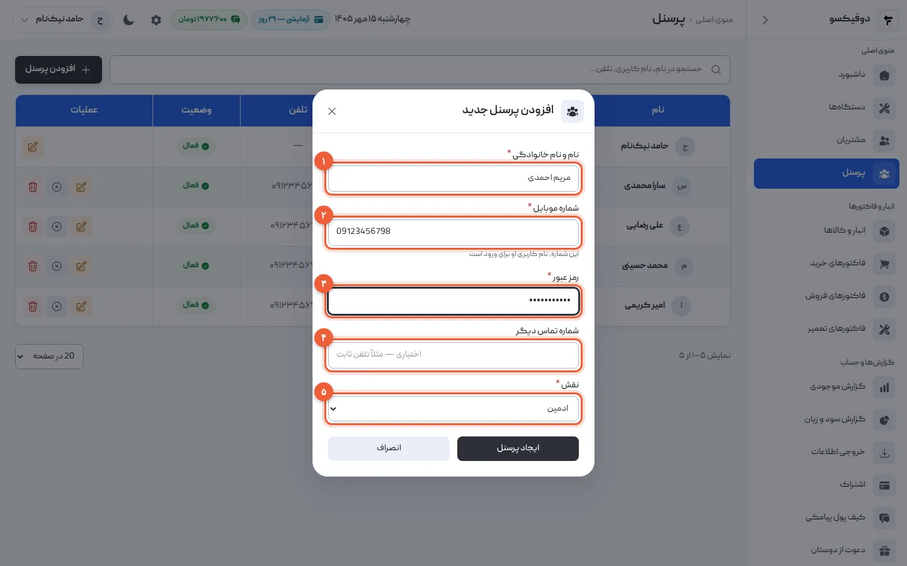
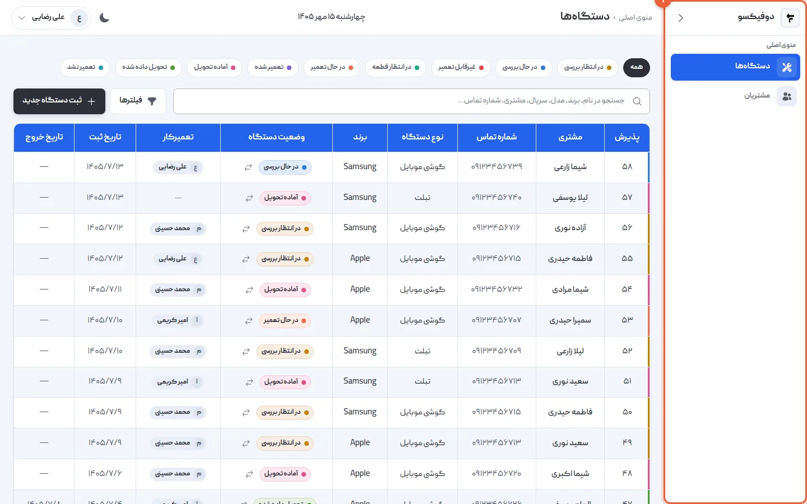
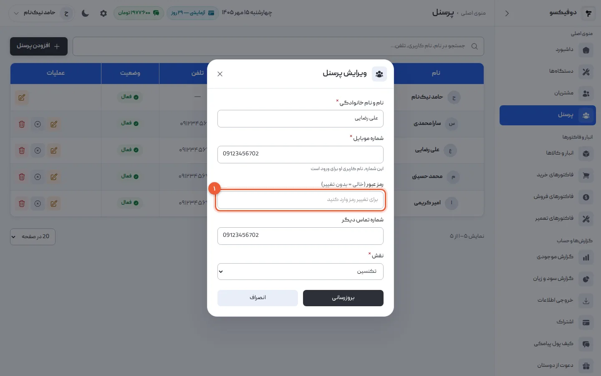
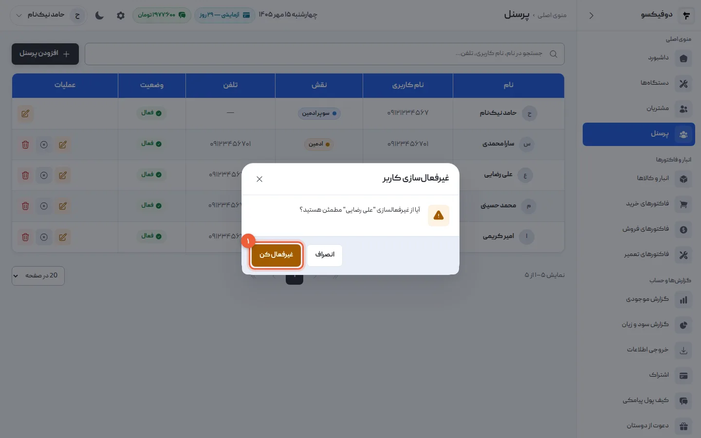
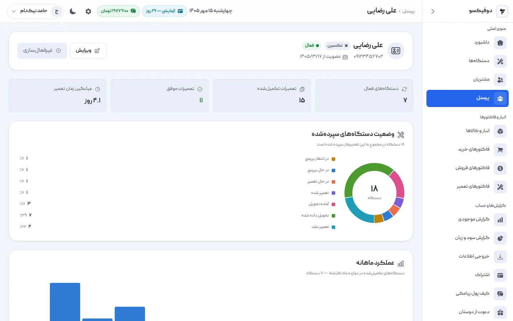
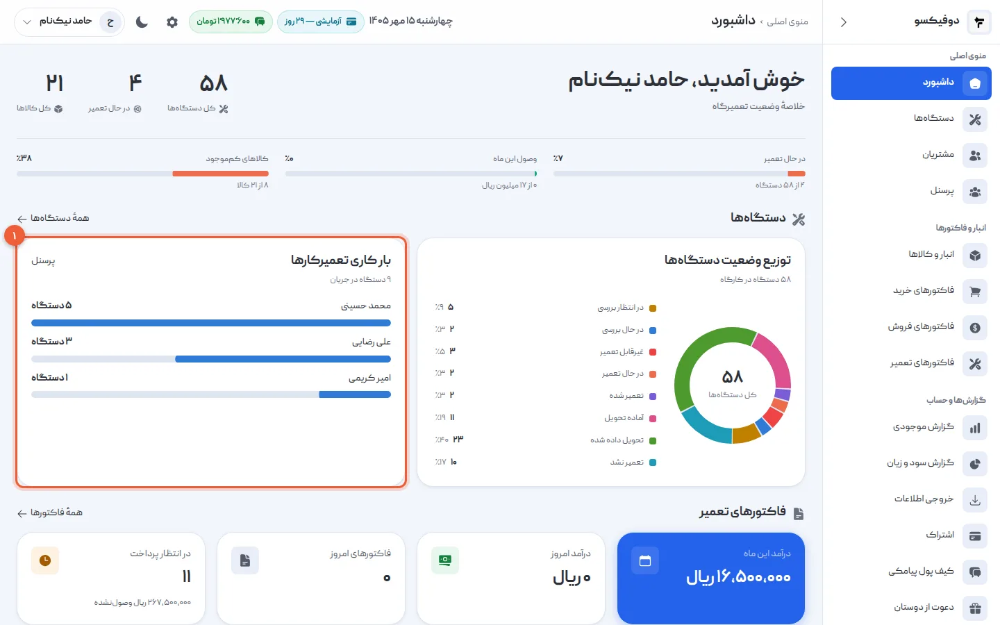

وقتی همه با یک حساب کار کنند، معلوم نیست کدام گوشی دست کیست، تعمیرکار فاکتورها و
سود مغازه را می‌بیند، و اگر کسی رفت، رمز را باید برای همه عوض کرد. در دوفیکسو هر
نفر حساب خودش را دارد — با شماره‌ی موبایل خودش — و فقط چیزی را می‌بیند که نقشش
اجازه می‌دهد. تعداد کاربر هم محدود نیست.

در این آموزش یک حساب تازه می‌سازیم، نقش‌ها را مرور می‌کنیم، رمز عوض می‌کنیم، کسی
را غیرفعال می‌کنیم و صفحه‌ی عملکرد هر تعمیرکار را می‌بینیم.

## ۱. صفحه‌ی پرسنل را باز کنید

از منوی کناری **«پرسنل»** را باز کنید. همه‌ی کسانی که به دوفیکسوی تعمیرگاه دسترسی
دارند این‌جا هستند، با نقش و وضعیتشان. دکمه‌ی **«افزودن پرسنل»** (۱) بالای
جدول است.

## ۲. حساب تازه بسازید

«افزودن پرسنل» را بزنید:

- **نام و نام خانوادگی** (۱)
- **شماره موبایل** (۲): نام کاربری این نفر برای ورود. باید شماره‌ی موبایل خودش
  باشد، با ۰۹.
- **رمز عبور** (۳): دست‌کم ۸ کاراکتر. به خود او بدهید.
- **شماره تماس دیگر** (۴): اختیاری؛ مثلاً تلفن ثابت.
- **نقش** (۵): «ادمین» یا «تکنسین» — قدم بعد.

«ایجاد پرسنل» را بزنید. حالا او با شماره و رمز خودش از
[app.dofixo.ir](https://app.dofixo.ir/login) وارد می‌شود — از کامپیوتر مغازه یا
گوشی خودش.

## ۳. نقش‌ها: چه کسی چه می‌بیند

سه نقش هست، و دسترسی هر نقش ثابت است:

| نقش | چه می‌بیند |
|---|---|
| **سوپر ادمین** | همه‌چیز، از جمله تنظیمات تعمیرگاه. همان کسی که حساب را ساخته. |
| **ادمین** | همه‌ی بخش‌های کاری: داشبورد، دستگاه‌ها، مشتری‌ها، پرسنل، انبار، فاکتورها، گزارش‌ها، اشتراک و کیف پول پیامکی — جز تنظیمات تعمیرگاه. ادمین فقط می‌تواند **تکنسین** اضافه کند. |
| **تکنسین** | فقط **دستگاه‌ها** و **مشتری‌ها**. در صفحه‌ی هر مشتری، فاکتورهای همان مشتری را هم می‌بیند. |

این تصویر، دوفیکسو از چشم یک تکنسین است: منو (۱) فقط دو گزینه دارد.

<Callout type="benefit">
تکنسین به **فهرست فاکتورها، انبار و قیمت خرید قطعه‌ها، گزارش سود و زیان و کیف پول
پیامکی** دسترسی ندارد. پس با خیال راحت به هر تعمیرکار حساب خودش را بدهید: کارش
را ثبت و پیگیری می‌کند، ولی حساب و کتاب مغازه جلوی چشمش نیست.
</Callout>

## ۴. رمز تازه برای کسی که رمزش را فراموش کرده

در ردیف همان نفر، **«ویرایش»** را بزنید. در فیلد **رمز عبور** (۱) رمز تازه را
بنویسید و «بروزرسانی» را بزنید. اگر این فیلد خالی بماند، رمز عوض نمی‌شود.

از همین فرم نام، شماره و نقش هم عوض می‌شوند. فقط نقشِ حساب **خودتان** را
نمی‌توانید عوض کنید — تا سوپر ادمین ناخواسته دسترسی خودش را از دست ندهد.

هر کس هم می‌تواند بدون شما، از «رمز عبور را فراموش کرده‌اید؟» در صفحه‌ی ورود،
خودش با کد پیامکی رمز تازه بسازد.

## ۵. کسی که رفته را غیرفعال کنید، نه حذف

در ردیف او، **«غیرفعال‌سازی»** را بزنید و در پنجره‌ی تأیید **«غیرفعال کن»** (۱).

از این لحظه با شماره و رمزش وارد نمی‌شود، و اگر همین حالا جایی وارد است، حداکثر
پانزده دقیقه بعد بیرون می‌افتد. هر وقت برگشت، با «فعال‌سازی» حسابش برمی‌گردد.

<Callout type="warning" title="حذف، سابقه را جدا می‌کند">
**حذف** پرسنل (فقط از دست سوپر ادمین) او را از همه‌ی دستگاه‌ها و فاکتورهایی که
کار کرده جدا می‌کند: دیگر معلوم نیست آن گوشی‌ها را چه کسی تعمیر کرده بود. برای کسی
که از مغازه رفته، **غیرفعال‌سازی** درست است: دسترسی قطع می‌شود و سابقه‌ی کارش
می‌ماند.
</Callout>

## ۶. صفحه‌ی هر تعمیرکار

روی نام هر نفر در فهرست بزنید. صفحه‌اش نشان می‌دهد:

- **دستگاه‌های فعال**: چند گوشی الان دستش است.
- **تعمیرات تکمیل‌شده** و **تعمیرات موفق**: کنار هم، معلوم است چه سهمی از کارش
  موفق بوده.
- **میانگین زمان تعمیر**: از تاریخ ورود دستگاه تا تاریخ خروجش، روی دستگاه‌هایی که
  تحویل شده‌اند.
- **وضعیت دستگاه‌های سپرده‌شده** و **عملکرد ماهانه** در دوازده ماه گذشته.

<Callout type="benefit">
وقتی هر دستگاه به تعمیرکار مشخصی سپرده می‌شود — در فرم پذیرش، و اگر لازم باشد به
بیش از یک نفر — این عددها خودشان جمع می‌شوند. برای حساب کردن دستمزد، تقسیم کار یا
گفت‌وگو با تعمیرکاری که کارش کند شده، عدد دارید، نه حس.
</Callout>

## ۷. بار کاری همه، روی داشبورد

در **«داشبورد»**، کارت **«بار کاری تعمیرکارها»** (۱) نشان می‌دهد هر نفر الان چند
دستگاه در جریان دارد.

گوشی تازه که رسید، یک نگاه به این کارت می‌گوید به چه کسی بسپاریدش.

## اگر … شد چه کنم؟

**«این نام کاربری قبلاً ثبت شده است»:** این شماره در دوفیکسو حساب دارد — شاید در
تعمیرگاه دیگری، یا خودش ثبت‌نام کرده. هر شماره فقط یک حساب دارد.

**تعمیرکار وارد نمی‌شود:** نام کاربری‌اش همان شماره موبایلی است که در «افزودن
پرسنل» نوشتید. اگر رمز یادش نیست، قدم ۴. اگر پیام «حساب کاربری غیرفعال است» را
می‌بیند، حسابش غیرفعال است؛ قدم ۵ را برعکس بروید.

**«ادمین فقط می‌تواند تکنسین ایجاد کند»:** ادمین‌ها فقط تکنسین می‌سازند. برای
ساختن ادمین تازه، سوپر ادمین باید وارد شود.

**دکمه‌ی حذف را نمی‌بینم:** حذف فقط برای سوپر ادمین است — و معمولاً غیرفعال‌سازی
گزینه‌ی بهتری است.

<NextStep
  title="حالا مشتری‌ها"
  to="tutorials/customers"
  label="آموزش ثبت مشتری"
>

هر مشتری یک پرونده دارد: دستگاه‌هایی که آورده، تعمیرهایش، فاکتورها و مانده‌ی
حسابش، و یادداشتی که فقط کارکنان می‌بینند.

</NextStep>
