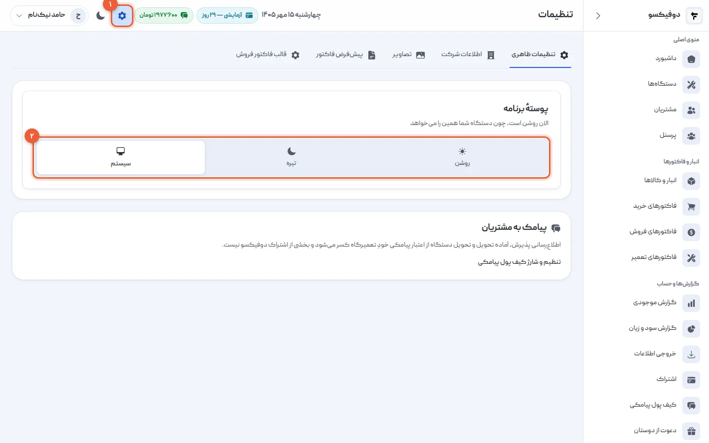
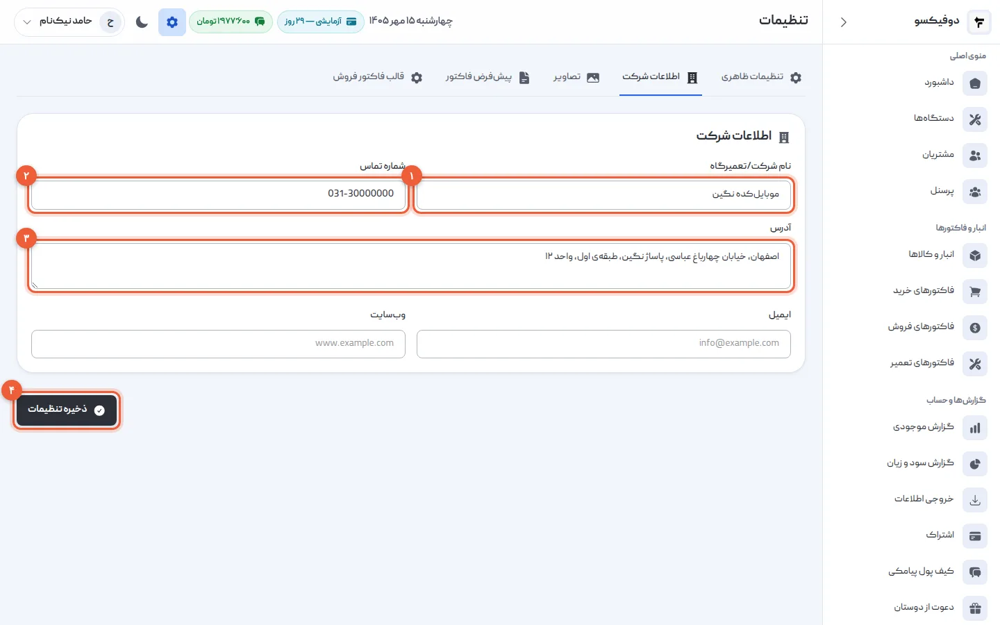
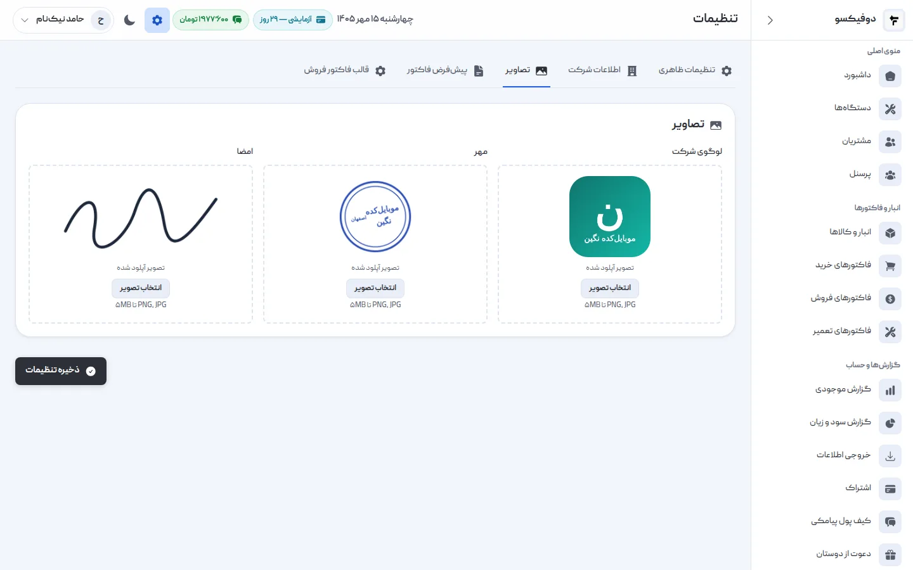
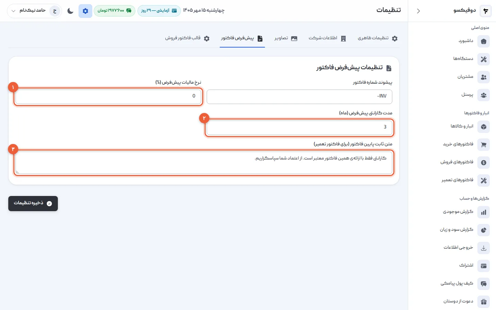
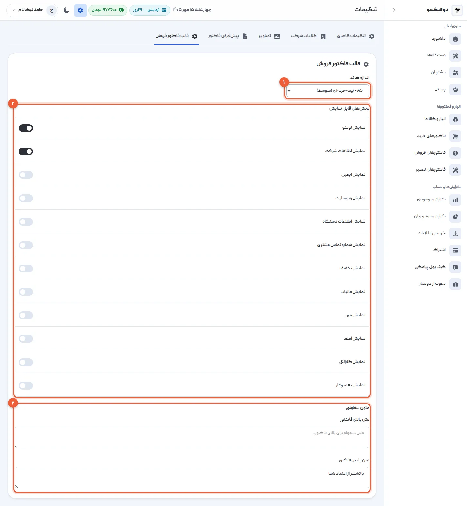
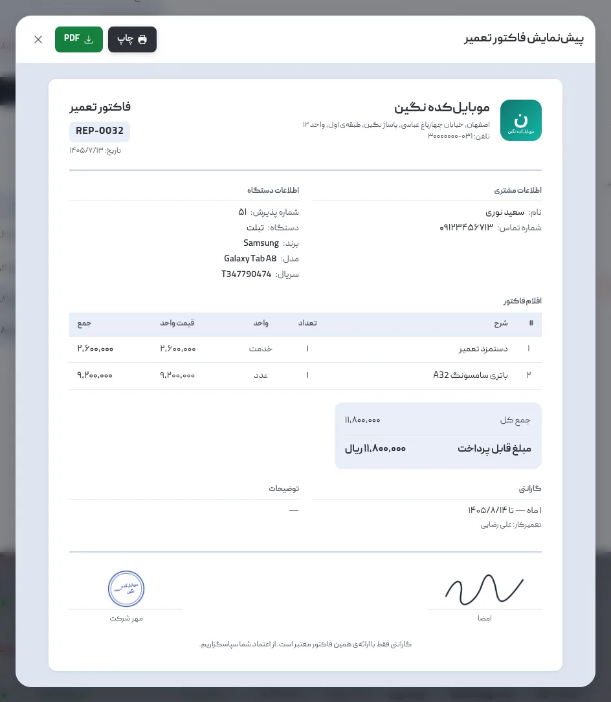

تنظیمات، جایی است که دوفیکسو را **مال تعمیرگاه خودتان** می‌کنید: نام و آدرسی که
روی فاکتور می‌آید، لوگو و مهر و امضا، گارانتی‌ای که معمولاً می‌دهید، و شکل فاکتور
فروش. همه را یک بار تنظیم می‌کنید و بعد هر فاکتور خودش درست پر می‌شود.

در این آموزش همه‌ی تب‌های تنظیمات را به ترتیب می‌بینیم. چهار تب از پنج تب را فقط
**سوپر ادمین** — سازنده‌ی حساب — می‌بیند. ادمین‌ها و تکنسین‌ها فقط تب «تنظیمات
ظاهری» را دارند.

## ۱. تنظیمات را باز کنید؛ پوسته را انتخاب کنید

روی آیکون چرخ‌دنده‌ی **«تنظیمات»** (۱) بالای صفحه بزنید. اولین تب، **«تنظیمات
ظاهری»**، پوسته‌ی برنامه است (۲): **روشن**، **تیره**، یا **سیستم** که از تنظیم
گوشی یا کامپیوترتان پیروی می‌کند.

پوسته روی **همان مرورگر** ذخیره می‌شود، نه برای کل تعمیرگاه: اگر شما روی گوشی خودتان
تیره را انتخاب کنید و تعمیرکار روی کامپیوتر مغازه روشن را، هر کدام همان را
می‌بینید.

پایین همین تب، کادر «پیامک به مشتریان» شما را به **کیف پول پیامکی** می‌برد؛ روشن
کردن پیامک و شارژش آن‌جاست، نه در تنظیمات.

## ۲. اطلاعات تعمیرگاه

تب **«اطلاعات شرکت»**:

- **نام شرکت/تعمیرگاه** (۱): همان نامی که در ثبت‌نام نوشتید، این‌جا عوض می‌شود.
- **شماره تماس** (۲): شماره‌ای که مشتری برای پیگیری می‌گیرد. اگر چند شماره دارید،
  با ویرگول جدا کنید.
- **آدرس** (۳)
- **ایمیل** و **وب‌سایت**: اختیاری.

«ذخیره تنظیمات» (۴) را بزنید.

<Callout type="benefit">
نام تعمیرگاه از همین‌جا به **پیامک‌های مشتری** و **سربرگ هر فاکتور** می‌رود، و
شماره و آدرس روی فاکتور چاپ می‌شوند. مشتری‌ای که ماه بعد با همان گوشی برگشت،
روی فاکتورش می‌بیند کجا را پیدا کند و به چه شماره‌ای زنگ بزند.
</Callout>

## ۳. لوگو، مهر و امضا

تب **«تصاویر»** سه جا برای تصویر دارد: **لوگوی شرکت**، **مهر** و **امضا**. روی
«انتخاب تصویر» زیر هر کدام بزنید و فایل را انتخاب کنید (PNG یا JPG، تا ۵ مگابایت).

هر تصویر **همان لحظه** ذخیره می‌شود؛ لازم نیست «ذخیره تنظیمات» را بزنید.

<Callout type="tip">
مهر و امضا را روی کاغذ سفید بزنید، با گوشی از روبه‌رو و در نور خوب عکس بگیرید و
دور عکس را ببرید. اگر فایل PNG با زمینه‌ی شفاف دارید، روی فاکتور تمیزتر می‌نشیند.
</Callout>

## ۴. مالیات، گارانتی و متن پایین فاکتور تعمیر

تب **«پیش‌فرض فاکتور»**:

- **نرخ مالیات پیش‌فرض (٪)** (۱): نرخی که هر فاکتور تعمیر تازه با آن باز
  می‌شود. اگر مالیات نمی‌گیرید، ۰ بگذارید.
- **مدت گارانتی پیش‌فرض (ماه)** (۲): گارانتی معمول شما روی تعمیر. پیش‌فرضش ۳ ماه
  است.
- **متن ثابت پایین فاکتور** (۳): جمله‌ای که زیر هر فاکتور تعمیر چاپ می‌شود؛ مثلاً
  شرط گارانتی.

«ذخیره تنظیمات» را بزنید. این‌ها **پیش‌فرض**اند: در هر فاکتور تعمیر می‌شود
عوضشان کرد، ولی لازم نیست هر بار بنویسیدشان.

شماره‌ی فاکتورها را دوفیکسو خودش می‌گذارد — `REP-0001` برای تعمیر، `SAL-0001` برای
فروش و `PUR-0001` برای خرید — پشت‌سرهم و بدون جاافتادگی.

<Callout type="benefit">
با گارانتی پیش‌فرض، **تاریخ پایان گارانتی** روی هر فاکتور تعمیر خودش حساب و چاپ
می‌شود. وقتی مشتری با همان گوشی برگشت، فاکتور جواب می‌دهد که گارانتی هنوز باقی
است یا نه — نه حافظه‌ی شما، نه حرف مشتری.
</Callout>

## ۵. قالب فاکتور فروش

تب **«قالب فاکتور فروش»** شکل فاکتورهای فروش را تعیین می‌کند:

- **اندازه کاغذ** (۱): **A4** (کامل)، **A5** (متوسط) یا **Thermal** — رسید باریک
  فروشگاهی، برای چاپگرهای حرارتی پشت پیشخوان.
- **بخش‌های قابل نمایش** (۲): لوگو، اطلاعات شرکت، ایمیل، وب‌سایت، اطلاعات دستگاه،
  شماره‌ی مشتری، تخفیف، مالیات، مهر، امضا، گارانتی و تعمیرکار — هر کدام را که
  نمی‌خواهید خاموش کنید.
- **متون سفارشی** (۳): متنی برای بالای فاکتور و متنی برای پایینش.

«ذخیره تنظیمات» را بزنید. این تب فقط روی **فاکتور فروش** اثر دارد؛ فاکتور تعمیر
قالب ثابت خودش را دارد.

<Callout type="tip">
اگر پشت پیشخوان چاپگر حرارتی دارید، Thermal را انتخاب کنید و بخش‌های کم‌اهمیت مثل
ایمیل و وب‌سایت را خاموش کنید تا رسید کوتاه بماند.
</Callout>

## ۶. نتیجه را روی یک فاکتور ببینید

یک فاکتور تعمیر را باز کنید و **«چاپ»** را بزنید. پیش‌نمایش، همان چیزی است که
مشتری می‌گیرد: لوگو و نام و آدرس تعمیرگاه بالا، گارانتی با تاریخ پایانش، و مهر و
امضا و متن پایین فاکتور زیرش.

از همین پیش‌نمایش می‌شود چاپ کرد یا **PDF** گرفت و برای مشتری فرستاد.

## اگر … شد چه کنم؟

**تب‌های «اطلاعات شرکت»، «تصاویر» و … را نمی‌بینم:** این تب‌ها فقط برای سوپر
ادمین — سازنده‌ی حساب — است. بالای صفحه نوشته «دسترسی محدود — فقط تنظیمات ظاهری».
با حساب او وارد شوید.

**تصویر بارگذاری نمی‌شود:** فایل باید تصویر باشد (PNG یا JPG) و از ۵ مگابایت
کوچک‌تر. عکس گوشی را پیش از بارگذاری کوچک کنید.

**گارانتی یا مالیات فاکتور با تنظیمات فرق دارد:** تنظیمات فقط مقدار **اولیه‌ی**
فاکتورهای تازه است. فاکتورهایی که قبلاً صادر شده‌اند، با همان مقدار خودشان
می‌مانند.

<NextStep
  title="تعمیرکارها را اضافه کنید"
  to="tutorials/personnel"
  label="آموزش تعریف تعمیرکار"
>

برای هر تعمیرکار حساب جدا بسازید: هر کس با شماره‌ی خودش وارد می‌شود، فقط
دستگاه‌ها و مشتری‌ها را می‌بیند، و کار هر نفر جدا شمرده می‌شود.

</NextStep>
