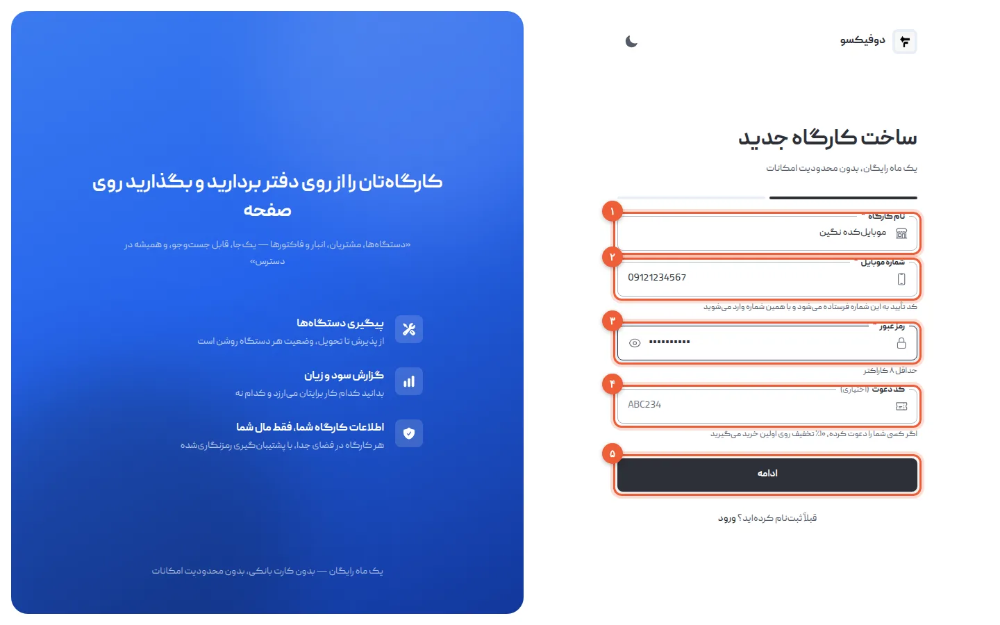
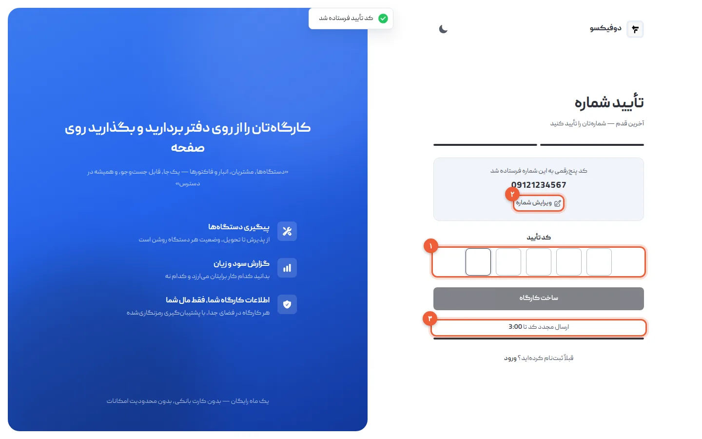
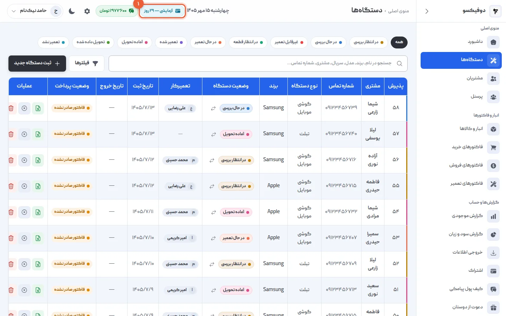
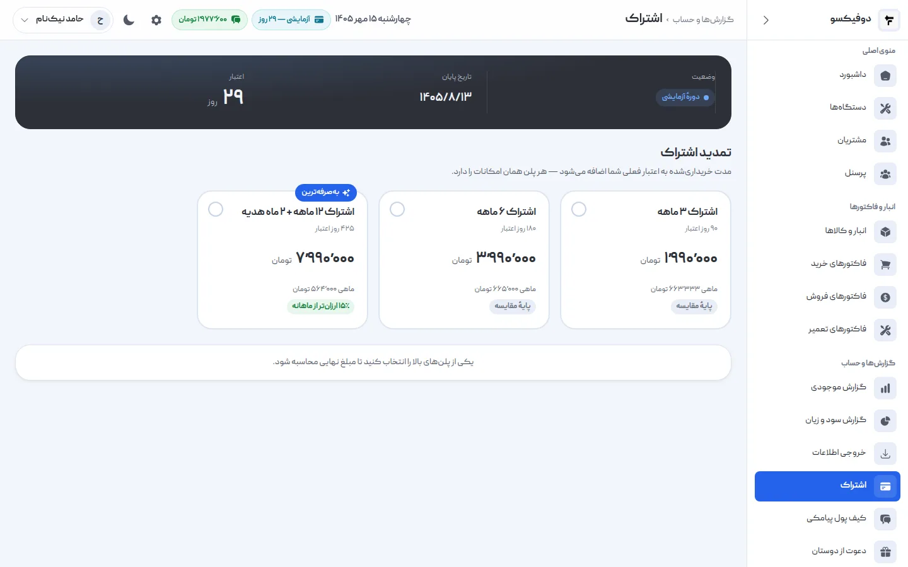
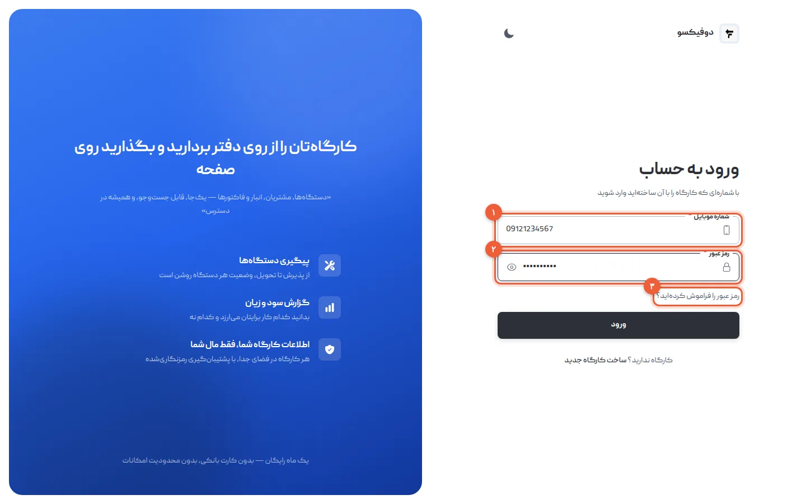
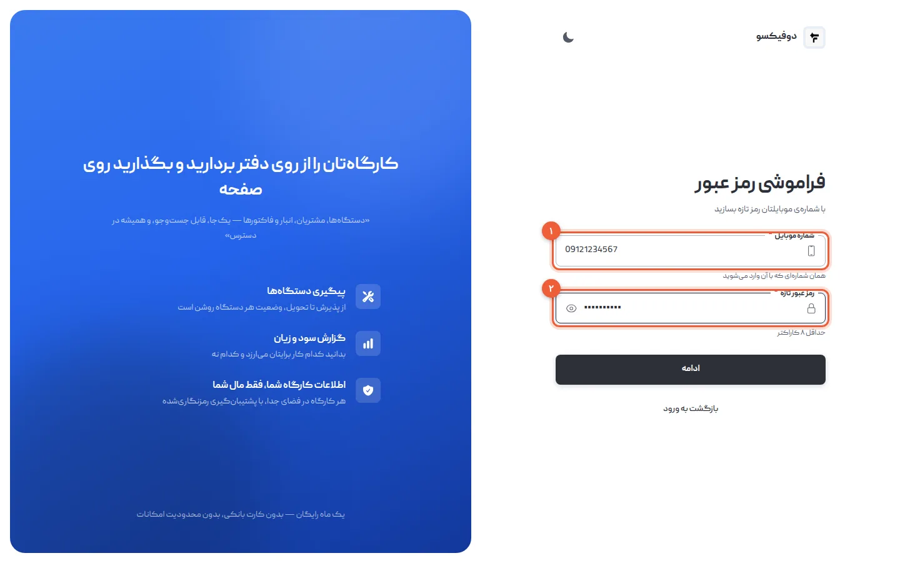
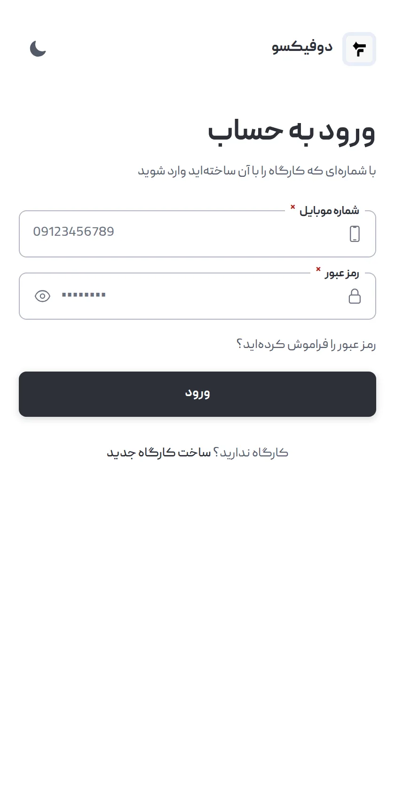

ثبت‌نام در دوفیکسو دو دقیقه طول می‌کشد: نام کارگاه، شماره موبایل، یک رمز و یک کد
پیامکی. در این آموزش همین چند قدم را با جزئیات می‌بینیم، و بعدش آنچه معمولاً
سؤال می‌شود: سی روز رایگان چطور حساب می‌شود، بعدش چه می‌شود، چطور از گوشی وارد
شوید و اگر رمز یادتان رفت چه کنید.

اگر می‌خواهید همه‌ی روز اول را یک‌جا ببینید — ثبت‌نام، اطلاعات تعمیرگاه،
تعمیرکارها و پیامک — [آموزش شروع سریع](/academy/tutorials/getting-started/) را
بخوانید. این آموزش فقط درباره‌ی خود حساب است.

## ۱. فرم «ساخت کارگاه جدید» را پر کنید

به [app.dofixo.ir/register](https://app.dofixo.ir/register) بروید:

- **نام کارگاه** (۱): همان نامی که مشتری‌ها می‌شناسند. در پیامک‌های مشتری و
  سربرگ فاکتور می‌آید، و بعداً از تنظیمات عوض می‌شود.
- **شماره موبایل** (۲): از این به بعد نام کاربری شماست. کد تأیید هم به همین
  شماره می‌آید.
- **رمز عبور** (۳): دست‌کم ۸ کاراکتر.
- **کد دعوت** (۴): اختیاری. اگر تعمیرگاه دیگری شما را معرفی کرده، کدش را این‌جا
  بنویسید.

«ادامه» (۵) را بزنید.

شماره را هر طور عادت دارید بنویسید — با رقم فارسی، با فاصله، یا با ‎+98‎ —
دوفیکسو خودش آن را به شکل ۰۹… در می‌آورد. فقط شماره‌ی موبایل پذیرفته می‌شود، نه
تلفن ثابت، چون کد تأیید پیامکی است.

<Callout type="benefit">
کد دعوت روی **اولین خرید اشتراک** شما ۱۰٪ تخفیف می‌دهد. اگر کسی لینک دعوتش را
برایتان فرستاده، با باز کردن همان لینک این فیلد خودش پر می‌شود.
</Callout>

## ۲. کد تأیید را وارد کنید

یک کد ۵ رقمی به شماره‌تان پیامک می‌شود. آن را در خانه‌ها (۱) وارد کنید و «ساخت
کارگاه» را بزنید.

- شماره را اشتباه زده‌اید؟ **«ویرایش شماره»** (۲) شما را به فرم برمی‌گرداند؛
  نام و رمز پاک نمی‌شوند.
- کد نیامد؟ وقتی **شمارش معکوس** (۳) تمام شد، «ارسال دوباره‌ی کد» را بزنید.

هر کد **۳ دقیقه** اعتبار دارد و فقط یک بار به کار می‌آید. برای هر شماره در هر
ساعت حداکثر سه کد فرستاده می‌شود؛ پس پیش از ارسال دوباره، چند لحظه صبر کنید.

با «ساخت کارگاه»، حساب ساخته می‌شود و مستقیم وارد دوفیکسو می‌شوید — به صفحه‌ی
«دستگاه‌ها».

<Callout type="tip">
اگر کد دعوتی که نوشتید درست نبود، ثبت‌نام **انجام می‌شود** و فقط تخفیف اعمال
نمی‌شود: پیام «کد دعوت شناسایی نشد. ثبت‌نام بدون تخفیف انجام شد» را می‌بینید.
لازم نیست از اول شروع کنید.
</Callout>

## ۳. سی روز رایگان، با همه‌ی امکانات

بالای همه‌ی صفحه‌ها، نشان **«آزمایشی»** (۱) می‌گوید چند روز از دوره‌ی رایگان
مانده است.

در این سی روز **همه‌ی امکانات** باز است: تعداد دستگاه، مشتری و کاربر محدود نیست
و هیچ بخشی قفل نیست. اطلاعات پرداخت هم نخواستیم.

<Callout type="benefit">
سی روز یعنی یک ماه کار واقعی: گوشی‌های همین ماه را در دوفیکسو پذیرش کنید،
فاکتورهایش را بزنید و آخر ماه گزارش سود و زیانش را ببینید. آن‌وقت تصمیم می‌گیرید،
نه از روی یک دمو.
</Callout>

## ۴. بعد از سی روز: اشتراک

از منوی کناری **«اشتراک»** را باز کنید. وضعیت حساب، تاریخ پایان و روزهای
باقی‌مانده بالای صفحه است، و پلن‌ها پایینش.

- **همه‌ی پلن‌ها امکانات یکسان دارند**؛ فقط مدت و قیمت فرق می‌کند. قیمت‌ها در
  [صفحه‌ی قیمت‌گذاری](/pricing/) است.
- لازم نیست صبر کنید تا دوره‌ی رایگان تمام شود: اگر وسطش بخرید، مدت پلن به
  **روزهای باقی‌مانده اضافه می‌شود** و چیزی از دست نمی‌دهید.
- پرداخت آنلاین است، از درگاه زیبال.

<Callout type="benefit">
اگر اشتراک را نخرید یا تمدید نکنید، **هیچ اطلاعاتی پاک نمی‌شود**. حساب فقط‌خواندنی
می‌شود: همه‌چیز را می‌بینید، ولی چیز تازه‌ای ثبت نمی‌شود. هر وقت تمدید کردید،
همه‌چیز سر جایش است.
</Callout>

## ۵. وارد شوید

از [app.dofixo.ir/login](https://app.dofixo.ir/login):

- **شماره موبایل** (۱): همان شماره‌ی ثبت‌نام.
- **رمز عبور** (۲)
- **«رمز عبور را فراموش کرده‌اید؟»** (۳): قدم بعد.

روی همان مرورگر وارد می‌مانید و لازم نیست هر بار رمز بزنید. می‌شود هم‌زمان از
کامپیوتر مغازه و گوشی خودتان وارد بود.

تعمیرکارها هم از همین صفحه وارد می‌شوند، با شماره‌ی خودشان. حساب آن‌ها را شما
می‌سازید — در [آموزش تعریف تعمیرکار](/academy/tutorials/personnel/).

## ۶. رمز را فراموش کرده‌اید؟ خودتان رمز تازه بسازید

لازم نیست با پشتیبانی تماس بگیرید. «رمز عبور را فراموش کرده‌اید؟» را بزنید:

1. **شماره موبایل** (۱) و **رمز عبور تازه** (۲) را بنویسید و «ادامه» را بزنید.
2. کدی که پیامک می‌شود را وارد کنید و «تغییر رمز عبور» را بزنید.

حالا با رمز تازه وارد شوید.

<Callout type="benefit">
با تغییر رمز، **از همه‌ی دستگاه‌هایی که با رمز قبلی وارد بودند خارج می‌شوید**. اگر
فکر می‌کنید کس دیگری رمزتان را می‌داند — مثلاً کارمندی که دیگر با شما کار
نمی‌کند — همین یک کار کافی است تا دسترسی‌اش قطع شود.
</Callout>

## ۷. از گوشی وارد شوید

دوفیکسو برنامه‌ی نصبی ندارد و لازم هم ندارد: در مرورگر گوشی همان
**app.dofixo.ir** را باز کنید و با همان شماره و رمز وارد شوید. همه‌ی بخش‌ها روی
گوشی هم هستند.

دوفیکسو به اینترنت نیاز دارد؛ حالت آفلاین ندارد.

## شما هم دعوت کنید

از منوی کناری **«دعوت از دوستان»** کد و لینک دعوت خودتان را بردارید. هر تعمیرگاهی
که با کد یا لینک شما ثبت‌نام کند و **اولین اشتراکش** را بخرد، **۳۰ روز** به
اشتراک شما اضافه می‌کند — و خودش هم روی همان خرید ۱۰٪ تخفیف می‌گیرد.

## اگر … شد چه کنم؟

**«این شماره موبایل قبلاً ثبت شده است»:** با این شماره حساب دارید، یا تعمیرگاه
دیگری شما را به‌عنوان پرسنل تعریف کرده. از صفحه‌ی ورود وارد شوید، و اگر رمز
یادتان نیست، از قدم ۶.

**کد تأیید نیامد:** شماره را با «ویرایش شماره» دوباره نگاه کنید. بعد از تمام شدن
شمارش معکوس، «ارسال دوباره‌ی کد» را بزنید.

**«تعداد درخواست کد بیش از حد مجاز است. یک ساعت دیگر تلاش کنید»:** برای این شماره
در یک ساعت گذشته سه کد فرستاده شده. یک ساعت بعد دوباره امتحان کنید.

**«ارسال پیامک به این شماره ممکن نیست»:** اپراتور اجازه‌ی پیامک به این شماره را
نمی‌دهد. با [پشتیبانی](/contact/) تماس بگیرید.

**«نام کاربری یا رمز عبور اشتباه است»:** شماره و رمز را دوباره نگاه کنید؛ اگر رمز
یادتان نیست، قدم ۶.

**«حساب کاربری غیرفعال است»:** مدیر تعمیرگاه حساب شما را غیرفعال کرده است. با او
تماس بگیرید.

<NextStep
  title="حساب آماده است؛ اطلاعات تعمیرگاه را وارد کنید"
  to="tutorials/settings"
  label="آموزش تنظیمات"
>

نام، آدرس، لوگو، مهر و امضای تعمیرگاه یک بار در تنظیمات وارد می‌شوند و روی هر
فاکتوری که چاپ می‌کنید می‌آیند — همراه با گارانتی پیش‌فرض و متن پایین فاکتور.

</NextStep>
